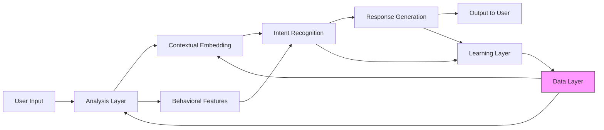
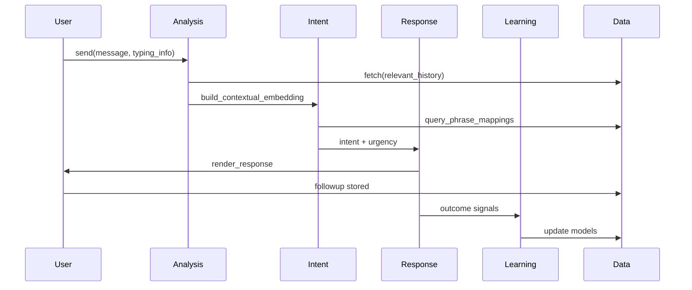
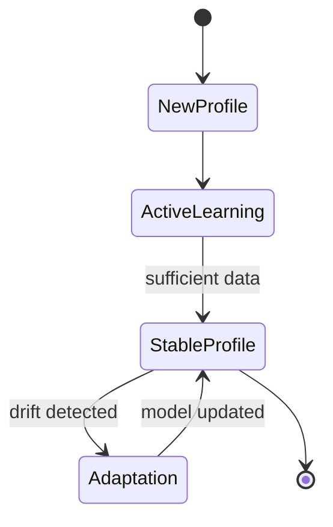
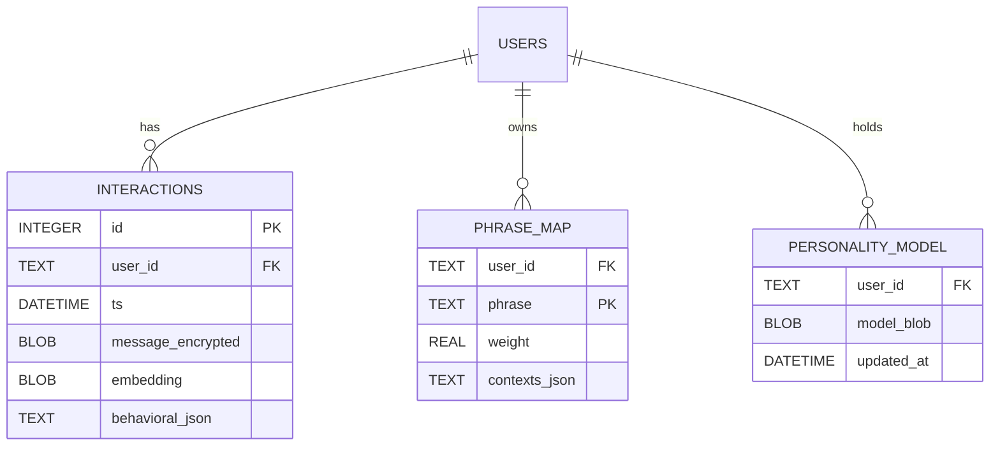

# AI Companion System Architecture

This document contains diagrams describing the system components and data flow.

## Components
- Data Layer (SQLite + Encryption)
- Analysis Layer (behavioral + semantic)
- Intent Recognition Layer (phrase graphs + distributions)
- Response Generation Layer (strategy + templates)
- Learning Layer (updates + pruning)
- Utilities (embeddings, personality NN, crypto)

## Architecture Diagram

## Sequence Diagram (Interaction Cycle)

## State Diagram (User Understanding Evolution)

## Entity-Relationship Diagram (Storage)
