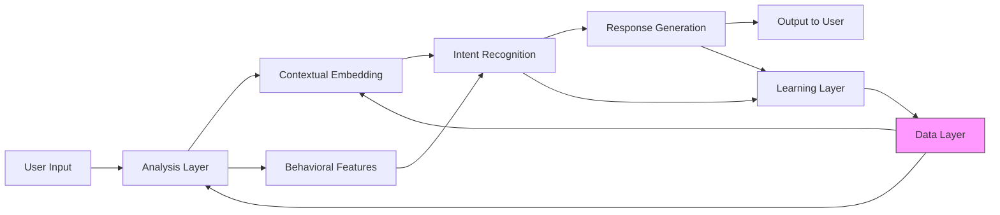
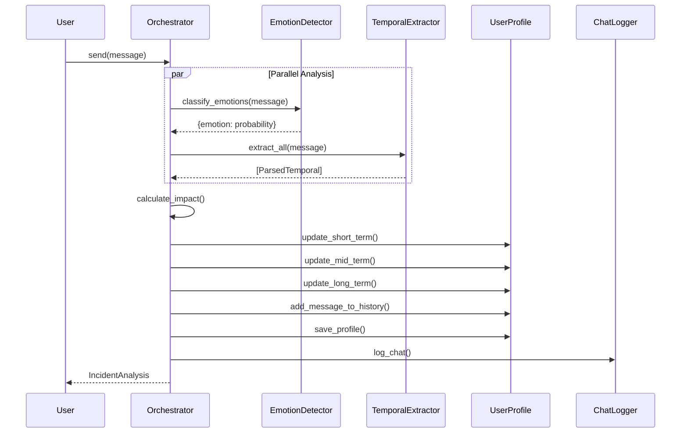

# 03 — Architecture

> **Reading time:** 15 minutes  
> **Prerequisites:** [01-introduction.md](./01-introduction.md), [02-quick-start.md](./02-quick-start.md)  
> **Next:** [04-data-flow.md](./04-data-flow.md)

---

## System Overview

The Emotional State Analysis Module follows a **layered architecture** with clear separation of concerns. Each component has a single, well-defined responsibility.

---

## High-Level Architecture



---

## Component Stack

```
┌─────────────────────────────────────────────────────────────┐
│                     USER INTERFACE                           │
│            (test_orchestrator.py / auto_test.py)            │
└──────────────────────────┬──────────────────────────────────┘
                           │
┌──────────────────────────▼──────────────────────────────────┐
│                      ORCHESTRATOR                            │
│                   (orchestrator.py)                         │
│    • Impact Calculation    • State Management               │
│    • Adaptive Weights      • Behavioral Analysis            │
└───────┬─────────────────────────────────────┬───────────────┘
        │                                     │
┌───────▼───────────┐               ┌─────────▼─────────┐
│ EMOTION DETECTOR  │               │ TEMPORAL EXTRACTOR│
│emotional_detector │               │temporal_extractor │
│      .py          │               │       .py         │
│                   │               │                   │
│ • HuggingFace API │               │ • Regex Patterns  │
│ • 27 emotions     │               │ • Date Parsing    │
│ • Multilingual    │               │ • Categorization  │
└───────┬───────────┘               └─────────┬─────────┘
        │                                     │
        └─────────────────┬───────────────────┘
                          │
┌─────────────────────────▼───────────────────────────────────┐
│                     USER PROFILE                             │
│                   (user_profile.py)                         │
│    • Short/Mid/Long Term States    • Message History        │
│    • Adaptive Weights              • JSON Persistence       │
└─────────────────────────┬───────────────────────────────────┘
                          │
┌─────────────────────────▼───────────────────────────────────┐
│                     CHAT LOGGER                              │
│                   (chat_logger.py)                          │
│    • Excel Export    • State Tracking    • History          │
└─────────────────────────────────────────────────────────────┘
```

---

## Component Responsibilities

### 1. Orchestrator (`orchestrator.py`)

**Role:** The brain — coordinates all other components

| Responsibility | Description |
|----------------|-------------|
| Message Processing | Receives user input, coordinates analysis |
| Impact Calculation | Combines emotion + temporal data into impact score |
| State Management | Decides how much each state (ST/MT/LT) is affected |
| Adaptive Learning | Adjusts weights based on user patterns |
| Behavioral Analysis | Tracks typing speed for additional signals |

**Key Class:** `ImpactCalculator`

---

### 2. Emotional Detector (`emotional_detector.py`)

**Role:** Detect emotions from text using AI

| Responsibility | Description |
|----------------|-------------|
| API Integration | Connects to HuggingFace Inference API |
| Emotion Classification | Returns 27 emotions with probability scores |
| Multilingual Support | Handles English, Hindi, Hinglish |

**Key Function:** `classify_emotions(text) → Dict[str, float]`

**Model Used:** `AnasAlokla/multilingual_go_emotions`

---

### 3. Temporal Extractor (`temporal_extractor.py`)

**Role:** Extract and parse time references

| Responsibility | Description |
|----------------|-------------|
| Pattern Matching | 40+ regex patterns for temporal phrases |
| Date Parsing | Uses `dateparser` for absolute dates |
| Categorization | Classifies as recent/medium/distant/future |
| Confidence Scoring | Rates extraction confidence |
| Tense Analysis | Resolves ambiguous phrases like "kal" |

**Key Class:** `TemporalExtractor`

---

### 4. User Profile (`user_profile.py`)

**Role:** Manage per-user emotional state

| Responsibility | Description |
|----------------|-------------|
| State Tracking | Maintains ST, MT, LT emotional states |
| EMA Updates | Applies Exponential Moving Average |
| History Storage | Keeps message history for pattern analysis |
| Persistence | Saves/loads profiles as JSON |
| Adaptive Weights | Stores learned weight adjustments |

**Key Class:** `UserProfile`

---

### 5. Chat Logger (`chat_logger.py`)

**Role:** Export chat history for analysis

| Responsibility | Description |
|----------------|-------------|
| Excel Creation | Creates formatted `.xlsx` files |
| State Logging | Records emotions per state per message |
| Activation Tracking | Shows which states are active |

**Key Class:** `ChatLogger`

---

## Interaction Sequence



---

## Design Principles

### 1. Single Responsibility
Each module does one thing well:
- `emotional_detector.py` → Only emotion detection
- `temporal_extractor.py` → Only time extraction
- `user_profile.py` → Only profile management

### 2. Loose Coupling
Modules communicate through simple data structures:
- Dictionaries for emotions
- Dataclasses for temporal data
- No direct dependencies between detector and extractor

### 3. Extensibility
Easy to add:
- New emotion models (swap HuggingFace model)
- New languages (add regex patterns)
- New time horizons (modify state config)

### 4. Persistence
State survives across sessions:
- User profiles saved as JSON
- Chat logs exported to Excel
- No data loss on restart

---

## File Dependency Graph

```
test_orchestrator.py
        │
        ▼
orchestrator.py ─────────────────────────┐
        │                                │
        ├──► emotional_detector.py       │
        │           │                    │
        │           └──► HuggingFace API │
        │                                │
        ├──► temporal_extractor.py       │
        │           │                    │
        │           └──► dateparser      │
        │                                │
        ├──► user_profile.py             │
        │           │                    │
        │           └──► JSON files      │
        │                                │
        └──► chat_logger.py              │
                    │                    │
                    └──► Excel files     │
```

---

## Key Data Structures

### Emotions Dictionary
```python
{
    "sadness": 0.72,
    "grief": 0.15,
    "love": 0.08,
    ...  # 27 total emotions
}
```

### Parsed Temporal
```python
ParsedTemporal(
    phrase="3 saal pehle",
    days_ago=1095,
    age_category="distant",
    confidence=0.95
)
```

### User Profile State
```python
{
    "short_term_state": {"sadness": 0.45, "joy": 0.12, ...},
    "mid_term_state": {"sadness": 0.35, ...},
    "long_term_state": {"neutral": 0.40, ...}
}
```

---

## What's Next?

Now that you understand the components, let's see how data flows through them:

👉 **Continue to [04-data-flow.md](./04-data-flow.md)** to understand the data pipeline.

---

**Navigation:**
| Previous | Current | Next |
|----------|---------|------|
| [02-quick-start.md](./02-quick-start.md) | 03-architecture.md | [04-data-flow.md](./04-data-flow.md) |
