# 04 — Data Flow

> **Reading time:** 15 minutes  
> **Prerequisites:** [03-architecture.md](./03-architecture.md)  
> **Next:** [05-core-concepts.md](./05-core-concepts.md)

---

## Overview

This document traces how data flows through the system from user input to profile update. Understanding this flow is essential for debugging and extending the module.

---

## The Complete Pipeline

```mermaid
graph TD
    A["💬 User Message"] --> B["🎯 Orchestrator"]
    
    B --> C["😊 Emotion Detection"]
    B --> D["⏰ Temporal Extraction"]
    
    C --> E["Emotions Dict"]
    D --> F["Temporal Info"]
    
    E --> G["📊 Impact Calculation"]
    F --> G
    
    G --> H["Impact Score"]
    
    H --> I["🔄 State Updates"]
    
    I --> J["⚡ Short-Term"]
    I --> K["📈 Mid-Term"]
    I --> L["🏛️ Long-Term"]
    
    J --> M["👤 User Profile"]
    K --> M
    L --> M
    
    M --> N["💾 JSON Save"]
    M --> O["📊 Excel Log"]
    
    O --> P["chat_logs.xlsx"]
    N --> Q["user_profiles/*.json"]
```



---

## Stage 1: Input

### User Message Arrives

```python
# Input
message = "3 saal pehle dadi chali gayi, aaj bhi yaad aati hai"

# Optional metadata
typing_speed = 4.5  # characters per second
timestamp = datetime.now()
```

---

## Stage 2: Parallel Analysis

The orchestrator runs two analyses **in parallel**:

### 2A: Emotion Detection

```
Input:  "3 saal pehle dadi chali gayi, aaj bhi yaad aati hai"
          │
          ▼
  ┌─────────────────────┐
  │  HuggingFace API    │
  │  text_classification │
  └──────────┬──────────┘
             │
             ▼
Output: {
    "sadness": 0.72,
    "grief": 0.15,
    "love": 0.08,
    "caring": 0.03,
    "neutral": 0.01,
    ...  # 27 emotions total
}
```

### 2B: Temporal Extraction

```
Input:  "3 saal pehle dadi chali gayi, aaj bhi yaad aati hai"
          │
          ▼
  ┌─────────────────────┐
  │  Regex Matching     │
  │  "3 saal pehle"     │
  └──────────┬──────────┘
             │
             ▼
  ┌─────────────────────┐
  │  Date Calculation   │
  │  3 years = 1095 days│
  └──────────┬──────────┘
             │
             ▼
  ┌─────────────────────┐
  │  Categorization     │
  │  1095 > 365 = distant│
  └──────────┬──────────┘
             │
             ▼
Output: ParsedTemporal(
    phrase="3 saal pehle",
    days_ago=1095,
    age_category="distant",
    confidence=0.95
)
```

---

## Stage 3: Impact Calculation

The orchestrator combines both analyses into a single impact score.

### 3A: Calculate Individual Factors

```python
# Factor 1: Emotion Intensity
max_probability = 0.72  # sadness
entropy = calculate_entropy(emotions)
entropy_penalty = max(0, entropy - 0.3)
emotion_intensity = 0.72 * (1 - entropy_penalty)  # ≈ 0.65

# Factor 2: Recency Weight
days_ago = 1095
lambda_factor = math.log(0.05) / 730
recency_weight = math.exp(lambda_factor * 1095)  # ≈ 0.10

# Factor 3: Temporal Confidence
temporal_confidence = 0.95

# Factor 4: Recurrence Boost
incident_count = 1  # first mention
recurrence_boost = 1 + (1 - 1) * 0.3  # = 1.0
```

### 3B: Apply Weighted Sum

```python
# Adaptive weights (from user profile)
weights = {
    'emotion_intensity': 0.45,    # Highest priority
    'recency_weight': 0.30,       # High priority
    'recurrence_boost': 0.15,     # Medium priority
    'temporal_confidence': 0.10   # Lowest priority
}

# Weighted sum
base_impact = (
    0.45 * 0.65 +   # emotion: 0.2925
    0.30 * 0.10 +   # recency: 0.0300
    0.15 * 0.00 +   # recurrence: 0.0000 (normalized)
    0.10 * 0.95     # confidence: 0.0950
)
# base_impact ≈ 0.42

# Apply behavior multiplier (typing speed)
behavior_multiplier = 1.0  # normal speed
final_impact = 0.42 * 1.0  # = 0.42
```

---

## Stage 4: State Impact Distribution

Based on the temporal category, determine how much each state is affected:

### Impact Multipliers Table

| Category | Short-Term | Mid-Term | Long-Term |
|----------|:----------:|:--------:|:---------:|
| **recent** | 1.0 | 0.6 | 0.2 |
| **medium** | 0.3 | 0.9 | 0.5 |
| **distant** | 0.05 | 0.3 | 0.8 |
| **future** | 0.7 | 0.4 | 0.0 |

### For Our Example (distant):

```python
age_category = "distant"
multipliers = {
    "short_term": 0.05,   # Minimal impact on current mood
    "mid_term": 0.30,     # Moderate impact on patterns
    "long_term": 0.80     # Strong impact on baseline
}
```

**Interpretation:** A 3-year-old loss primarily affects the long-term emotional baseline, not current mood.

---

## Stage 5: State Updates (EMA)

Each state is updated using Exponential Moving Average (EMA).

### Short-Term Update (α = 0.15)

```python
effective_impact = 0.42 * 0.05  # = 0.021 (minimal)

for emotion in ALL_EMOTIONS:
    old_value = short_term_state[emotion]
    new_value = detected_emotions.get(emotion, 0.0)
    
    # EMA update with effective impact
    effective_alpha = 0.15 * 0.021 / 0.42  # scaled
    short_term_state[emotion] = (
        effective_alpha * new_value + 
        (1 - effective_alpha) * old_value
    )
```

### Mid-Term Update (Rolling Window)

```python
# Uses last 15 messages for averaging
window = message_history[-15:]

for emotion in ALL_EMOTIONS:
    total = sum(msg['emotions'].get(emotion, 0) for msg in window)
    mid_term_state[emotion] = total / len(window)
```

### Long-Term Update (α = 0.02)

```python
effective_impact = 0.42 * 0.80  # = 0.336 (significant)

for emotion in ALL_EMOTIONS:
    old_value = long_term_state[emotion]
    new_value = detected_emotions.get(emotion, 0.0)
    
    # Slow EMA update
    effective_alpha = 0.02 * (0.336 / 0.42)  # ≈ 0.016
    long_term_state[emotion] = (
        effective_alpha * new_value + 
        (1 - effective_alpha) * old_value
    )
```

---

## Stage 6: Persistence

### 6A: Save to User Profile (JSON)

```python
profile.add_message_to_history(
    message=message,
    emotions=detected_emotions,
    temporal_info=temporal_result.to_dict(),
    impact_score=final_impact
)

profile.save_profile()
# Writes to: user_profiles/{user_id}.json
```

**JSON Structure:**
```json
{
    "user_id": "user123",
    "message_count": 151,
    "short_term_state": {"sadness": 0.45, ...},
    "mid_term_state": {"sadness": 0.35, ...},
    "long_term_state": {"sadness": 0.28, ...},
    "message_history": [...]
}
```

### 6B: Log to Excel

```python
logger.log_chat(
    message=message,
    impact_score=final_impact,
    current_state={...},
    profile_state={...},
    activation_status={...}
)
# Appends to: chat_logs.xlsx
```

---

## Stage 7: Output

### IncidentAnalysis Returned

```python
result = IncidentAnalysis(
    emotions={
        "sadness": 0.72,
        "grief": 0.15,
        "love": 0.08,
        ...
    },
    temporal={
        "phrase": "3 saal pehle",
        "days_ago": 1095,
        "category": "distant",
        "confidence": 0.95
    },
    impact_score=0.42,
    state_updates={
        "short_term": {"sadness": 0.45, ...},
        "mid_term": {"sadness": 0.35, ...},
        "long_term": {"sadness": 0.28, ...}
    }
)
```

---

## Data Flow Summary

```
┌─────────────────────────────────────────────────────────────┐
│  USER MESSAGE                                                │
│  "3 saal pehle dadi chali gayi..."                          │
└──────────────────────────┬──────────────────────────────────┘
                           │
         ┌─────────────────┴─────────────────┐
         ▼                                   ▼
┌─────────────────┐                 ┌─────────────────┐
│ EMOTIONS        │                 │ TEMPORAL        │
│ {sadness: 0.72} │                 │ {days: 1095}    │
└────────┬────────┘                 └────────┬────────┘
         │                                   │
         └─────────────────┬─────────────────┘
                           ▼
┌─────────────────────────────────────────────────────────────┐
│  IMPACT CALCULATION                                          │
│  0.45×0.65 + 0.30×0.10 + 0.15×0.00 + 0.10×0.95 = 0.42      │
└──────────────────────────┬──────────────────────────────────┘
                           │
                           ▼
┌─────────────────────────────────────────────────────────────┐
│  STATE DISTRIBUTION (distant → LT focus)                     │
│  ST: 0.05    MT: 0.30    LT: 0.80                           │
└──────────────────────────┬──────────────────────────────────┘
                           │
         ┌─────────────────┼─────────────────┐
         ▼                 ▼                 ▼
┌─────────────┐   ┌─────────────┐   ┌─────────────┐
│ ST (α=0.15) │   │ MT (window) │   │ LT (α=0.02) │
│ minimal     │   │ moderate    │   │ significant │
│ change      │   │ change      │   │ change      │
└─────────────┘   └─────────────┘   └─────────────┘
         │                 │                 │
         └─────────────────┼─────────────────┘
                           ▼
┌─────────────────────────────────────────────────────────────┐
│  PERSISTENCE                                                 │
│  → user_profiles/user123.json                               │
│  → chat_logs.xlsx                                           │
└─────────────────────────────────────────────────────────────┘
```

---

## What's Next?

Now that you understand how data flows, let's dive into the core concepts (EMA, PRISM, State Management):

👉 **Continue to [05-core-concepts.md](./05-core-concepts.md)** to understand the theory.

---

**Navigation:**
| Previous | Current | Next |
|----------|---------|------|
| [03-architecture.md](./03-architecture.md) | 04-data-flow.md | [05-core-concepts.md](./05-core-concepts.md) |
