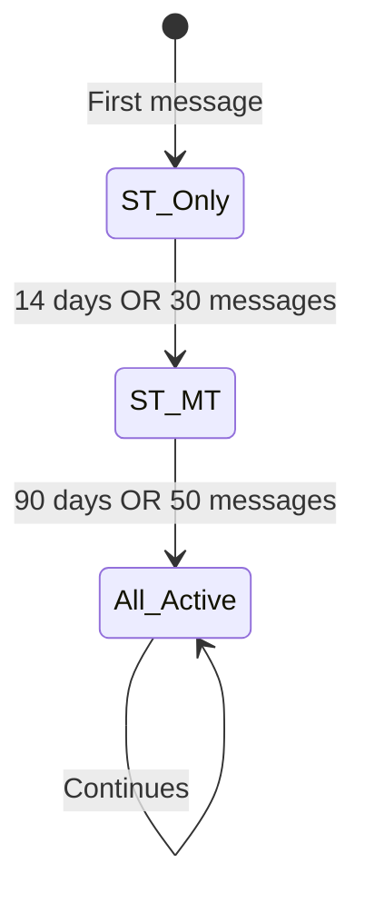

# 05 — Core Concepts

> **Reading time:** 20 minutes  
> **Prerequisites:** [04-data-flow.md](./04-data-flow.md)  
> **Next:** [06-module-reference.md](./06-module-reference.md)

---

## Overview

This document explains the three theoretical foundations of the module:

1. **EMA (Exponential Moving Average)** — How emotions are smoothly tracked
2. **Three Temporal States** — Short-term, Mid-term, Long-term
3. **PRISM Scoring** — How to classify incident significance

---

# Part 1: EMA (Exponential Moving Average)

## What is EMA?

**Exponential Moving Average** is a smoothing technique that blends new observations with accumulated history. Unlike simple averaging, EMA gives more weight to recent data while gradually forgetting old data.

### The Formula

```
EMA(t) = α × New_Value + (1 - α) × EMA(t-1)
```

Where:
- `α` (alpha) = learning rate (0 to 1)
- Higher α = faster adaptation, more weight on new data
- Lower α = slower adaptation, more weight on history

---

## Why EMA for Emotions?

### Problem with Simple Averaging

```
Simple Average of last 5 emotions:
[0.8, 0.2, 0.6, 0.3, 0.7] → avg = 0.52

All values weighted equally — but the most recent (0.7) 
should matter more than the oldest (0.8)!
```

### Solution: EMA

```
EMA with α = 0.3:
Start:  0.8
Add 0.2: 0.3×0.2 + 0.7×0.8 = 0.62
Add 0.6: 0.3×0.6 + 0.7×0.62 = 0.61
Add 0.3: 0.3×0.3 + 0.7×0.61 = 0.52
Add 0.7: 0.3×0.7 + 0.7×0.52 = 0.57

Recent values influence more, smooth transitions!
```

---

## Learning Rate (α) Behavior

| α | Memory Window | Behavior | Use Case |
|---|---------------|----------|----------|
| 0.02 | ~50 updates | Very slow, stable | Long-term baseline |
| 0.05 | ~20 updates | Slow | Behavioral trends |
| 0.10 | ~10 updates | Moderate | General tracking |
| **0.15** | ~7 updates | Responsive | **Short-term mood** |
| 0.25 | ~4 updates | Fast | Quick reactions |

**Memory Window ≈ 1/α**

---

## EMA in This Module

### Short-Term State (α = 0.15)

```python
# Fast adaptation — captures current mood
for emotion in ALL_EMOTIONS:
    old = short_term_state[emotion]
    new = detected_emotions.get(emotion, 0.0)
    short_term_state[emotion] = 0.15 * new + 0.85 * old
```

### Long-Term State (α = 0.02)

```python
# Slow adaptation — stable personality baseline
for emotion in ALL_EMOTIONS:
    old = long_term_state[emotion]
    new = detected_emotions.get(emotion, 0.0)
    long_term_state[emotion] = 0.02 * new + 0.98 * old
```

---

## Adaptive Learning Rate

As profiles mature, the learning rate decreases for stability:

```python
def get_effective_alpha(base_alpha, message_count, decay_constant=200):
    return base_alpha / (1 + message_count / decay_constant)
```

| Messages | Base α | Effective α |
|----------|--------|-------------|
| 0 | 0.15 | 0.150 |
| 50 | 0.15 | 0.120 |
| 100 | 0.15 | 0.100 |
| 200 | 0.15 | 0.075 |
| 500 | 0.15 | 0.043 |

**Result:** New profiles learn fast, mature profiles stabilize.

---

# Part 2: Three Temporal States

## Why Three States?

Different emotions have different time horizons:

| Emotion Type | Example | Duration |
|--------------|---------|----------|
| Transient mood | "Traffic made me angry" | Hours |
| Ongoing situation | "Job stress for weeks" | Weeks-months |
| Life event | "Lost a parent" | Years-permanent |

One state can't capture all of these effectively.

---

## The Three States

### ⚡ Short-Term (ST)

| Property | Value |
|----------|-------|
| Time horizon | 0-14 days |
| Learning rate | α = 0.15 |
| Activation | Always (from message 1) |
| Purpose | Current mood |

**Example:** "I'm stressed about tomorrow's meeting"

---

### 📈 Mid-Term (MT)

| Property | Value |
|----------|-------|
| Time horizon | 2 weeks - 4 months |
| Method | Rolling window (15 messages) |
| Activation | 14 days OR 30 messages |
| Purpose | Ongoing patterns |

**Example:** "Work has been overwhelming lately"

---

### 🏛️ Long-Term (LT)

| Property | Value |
|----------|-------|
| Time horizon | 4+ months (permanent) |
| Learning rate | α = 0.02 |
| Activation | 90 days OR 50 messages |
| Purpose | Personality baseline |

**Example:** "Ever since my divorce 2 years ago..."

---

## State Activation

States don't activate immediately — they need sufficient data:



**Why?** Mid-term and long-term patterns need historical data to be meaningful.

---

## Impact Distribution

How temporal category affects each state:

```
Event: "3 years ago I lost my grandmother"
Category: distant (1095 days)

Impact Distribution:
┌─────────────────────────────────────────────────┐
│ Short-Term  │████                    │ 5%       │
│ Mid-Term    │████████████            │ 30%      │
│ Long-Term   │████████████████████████████│ 80%  │
└─────────────────────────────────────────────────┘

→ Primarily affects long-term baseline
```

```
Event: "I'm stressed about tomorrow"
Category: future (-1 day)

Impact Distribution:
┌─────────────────────────────────────────────────┐
│ Short-Term  │████████████████████████│ 70%      │
│ Mid-Term    │████████████            │ 40%      │
│ Long-Term   │                        │ 0%       │
└─────────────────────────────────────────────────┘

→ Primarily affects short-term mood
```

---

# Part 3: PRISM Scoring (Future Implementation)

## What is PRISM?

**PRISM** is a framework for calculating incident significance:

```
Significance Score (SS) = (P × R × I × S) / M
```

---

## PRISM Components

| Letter | Component | Range | Description |
|:------:|-----------|-------|-------------|
| **P** | Persistence | 0.1-10 | Expected duration |
| **R** | Resonance | 1-10 | Emotional intensity |
| **I** | Impact | 1-5 | Life domains affected |
| **S** | Severity | 0.1-3 | Functional impairment |
| **M** | Malleability | 0.5-2 | Coping ability |

---

## PRISM Examples

### Example 1: Minor Work Stress

```
Persistence:  0.5  (few days)
Resonance:    4    (moderate)
Impact:       1    (work only)
Severity:     0.5  (mild)
Malleability: 1.5  (good coping)

SS = (0.5 × 4 × 1 × 0.5) / 1.5 = 0.67 → Short-Term
```

### Example 2: Job Loss

```
Persistence:  5    (months)
Resonance:    8    (high)
Impact:       3    (work, finance, identity)
Severity:     2    (significant)
Malleability: 1.0  (moderate coping)

SS = (5 × 8 × 3 × 2) / 1.0 = 240 → Long-Term
```

### Example 3: Relationship Issues

```
Persistence:  2    (weeks)
Resonance:    6    (strong)
Impact:       2    (relationships, mood)
Severity:     1.5  (moderate)
Malleability: 1.2  (some coping)

SS = (2 × 6 × 2 × 1.5) / 1.2 = 30 → Mid-Term
```

---

## Classification Thresholds

| Score Range | Classification |
|-------------|----------------|
| SS < 15 | Short-Term |
| 15 ≤ SS < 75 | Mid-Term |
| SS ≥ 75 | Long-Term |

---

## State Transitions

### Escalation: Compounding

Multiple short-term incidents can escalate to mid-term:

```
Rule: 3 ST incidents in 7 days → Escalate to MT

Example:
Day 1: "Traffic stress" (ST)
Day 3: "Meeting went bad" (ST)
Day 5: "Deadline pressure" (ST)
→ Escalate: "Work stress pattern" (MT)
```

### Resurgence: Trauma Triggers

Long-term events can resurface:

```
Rule: Anniversary or trigger → Reactivate LT

Example:
Original: Parent passed away (LT, year 1)
Year 2: Anniversary date → LT reactivates
Year 3: Visiting old home → LT reactivates
```

---

## Decay Mechanisms

### Short-Term Decay

Fast exponential decay:
```
Relevance(t) = Initial × e^(-0.3t)
```

| Days | Relevance |
|------|-----------|
| 0 | 100% |
| 2 | 55% |
| 7 | 12% |
| 14 | 1.5% (expires) |

### Mid-Term Decay

S-curve with 60-day half-life:
```
Relevance(t) = Initial / (1 + e^(k(t - 60)))
```

### Long-Term Decay

Asymptotic with resurgence potential:
```
Relevance(t) = Baseline + (Initial - Baseline) × e^(-μt) + triggers
```

Never fully decays — maintains baseline relevance.

---

## Summary Table

| Concept | Purpose | Key Formula |
|---------|---------|-------------|
| **EMA** | Smooth state updates | `α × new + (1-α) × old` |
| **Three States** | Multi-horizon tracking | ST / MT / LT |
| **PRISM** | Incident classification | `(P×R×I×S) / M` |
| **Decay** | Time-based relevance | Exponential / S-curve |

---

## What's Next?

Now that you understand the theory, let's look at each module in detail:

👉 **Continue to [06-module-reference.md](./06-module-reference.md)** for file-by-file documentation.

---

**Navigation:**
| Previous | Current | Next |
|----------|---------|------|
| [04-data-flow.md](./04-data-flow.md) | 05-core-concepts.md | [06-module-reference.md](./06-module-reference.md) |
