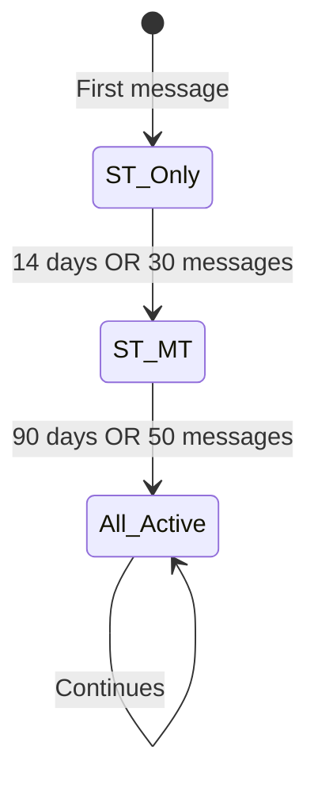

# 05 — Core Concepts

> **Prerequisites:** [04-data-flow.md](./04-data-flow.md)  
> **Next:** [06-module-reference.md](./06-module-reference.md)

---

## Overview

This document explains the three theoretical foundations of the module:

1. **EMA (Exponential Moving Average)** — How emotions are smoothly tracked
2. **Three Temporal States** — Short-term, Mid-term, Long-term
3. **PRISM Scoring** — How to classify incident significance

---

# Part 1: EMA (Exponential Moving Average)

## What is EMA?

**Exponential Moving Average** is a smoothing technique that blends new observations with accumulated history. Unlike simple averaging, EMA gives more weight to recent data while gradually forgetting old data.

### The Formula

```
EMA(t) = α × New_Value + (1 - α) × EMA(t-1)
```

Where:
- `α` (alpha) = learning rate (0 to 1)
- Higher α = faster adaptation, more weight on new data
- Lower α = slower adaptation, more weight on history

---

## Why EMA for Emotions?

### Problem with Simple Averaging

```
Simple Average of last 5 emotions:
[0.8, 0.2, 0.6, 0.3, 0.7] → avg = 0.52

All values weighted equally — but the most recent (0.7) 
should matter more than the oldest (0.8)!
```

### Solution: EMA

```
EMA with α = 0.3:
Start:  0.8
Add 0.2: 0.3×0.2 + 0.7×0.8 = 0.62
Add 0.6: 0.3×0.6 + 0.7×0.62 = 0.61
Add 0.3: 0.3×0.3 + 0.7×0.61 = 0.52
Add 0.7: 0.3×0.7 + 0.7×0.52 = 0.57

Recent values influence more, smooth transitions!
```

---

## Learning Rate (α) Behavior

| α | Memory Window | Behavior | Use Case |
|---|---------------|----------|----------|
| 0.02 | ~50 updates | Very slow, stable | Long-term baseline |
| 0.05 | ~20 updates | Slow | Behavioral trends |
| 0.10 | ~10 updates | Moderate | General tracking |
| **0.15** | ~7 updates | Responsive | **Short-term mood** |
| 0.25 | ~4 updates | Fast | Quick reactions |

**Memory Window ≈ 1/α**

---

## EMA in This Module

### Short-Term State (α = 0.15)

```python
# Fast adaptation — captures current mood
for emotion in ALL_EMOTIONS:
    old = short_term_state[emotion]
    new = detected_emotions.get(emotion, 0.0)
    short_term_state[emotion] = 0.15 * new + 0.85 * old
```

### Long-Term State (α = 0.02)

```python
# Slow adaptation — stable personality baseline
for emotion in ALL_EMOTIONS:
    old = long_term_state[emotion]
    new = detected_emotions.get(emotion, 0.0)
    long_term_state[emotion] = 0.02 * new + 0.98 * old
```

---

## Adaptive Learning Rate

As profiles mature, the learning rate decreases for stability:

```python
def get_effective_alpha(base_alpha, message_count, decay_constant=200):
    return base_alpha / (1 + message_count / decay_constant)
```

| Messages | Base α | Effective α |
|----------|--------|-------------|
| 0 | 0.15 | 0.150 |
| 50 | 0.15 | 0.120 |
| 100 | 0.15 | 0.100 |
| 200 | 0.15 | 0.075 |
| 500 | 0.15 | 0.043 |

**Result:** New profiles learn fast, mature profiles stabilize.

---

## Adaptive Weight Modification

> **Key Feature:** SS weights start fixed but **adapt during conversation** based on the user's emotional patterns.

### Initial Weights (Default)

```python
base_weights = {
    "intensity": 0.25,
    "persistence": 0.20,
    "recency": 0.20,
    "impact": 0.15,
    "volatility": 0.20
}
```

### How Weights Adapt

The `_adapt_weights_based_on_pattern()` function adjusts weights based on user's emotional history:

```python
def _adapt_weights_based_on_pattern(self, state_type: str) -> Dict[str, float]:
    """Adapt SS weights based on user's emotional patterns"""
    
    base_weights = {
        "intensity": 0.25,
        "persistence": 0.20,
        "recency": 0.20,
        "impact": 0.15,
        "volatility": 0.20
    }
    
    # Get recent history for this state
    state_data = self.profile["states"].get(state_type, {})
    history = state_data.get("recent_intensities", [])
    
    if len(history) < 3:
        return base_weights  # Not enough data to adapt
    
    # Calculate volatility trend
    volatility = statistics.stdev(history) if len(history) >= 2 else 0
    
    # Adapt weights based on patterns
    adapted = base_weights.copy()
    
    if volatility > 0.3:  # High volatility user
        adapted["volatility"] = min(0.30, adapted["volatility"] + 0.05)
        adapted["persistence"] = max(0.10, adapted["persistence"] - 0.05)
    
    # Normalize to ensure sum = 1.0
    total = sum(adapted.values())
    return {k: v/total for k, v in adapted.items()}
```

### Adaptation Rules

| Pattern Detected | Condition | Weight Adjustment |
|------------------|-----------|-------------------|
| High emotional volatility | `volatility > 0.3` | ↑ Volatility (+0.05), ↓ Persistence (-0.05) |
| Stable emotional state | `volatility < 0.1` | ↑ Persistence (+0.03), ↓ Volatility (-0.03) |
| Frequent intense emotions | `avg_intensity > 0.7` | ↓ Intensity (-0.03) to normalize |
| Low engagement | `history_count < 3` | Use base weights (no adaptation) |

### Weight Constraints

```python
MIN_WEIGHT = 0.10  # No weight below 10%
MAX_WEIGHT = 0.30  # No weight above 30%

# Always normalized: sum(weights.values()) == 1.0
```

### Example: Weight Evolution

```
User: High anxiety, frequent mood swings

Session 1 (Initial - not enough data):
┌─────────────┬──────────────┬─────────┬────────┬────────────┐
│ Intensity   │ Persistence  │ Recency │ Impact │ Volatility │
│    0.25     │     0.20     │  0.20   │  0.15  │    0.20    │
└─────────────┴──────────────┴─────────┴────────┴────────────┘

Session 5 (volatility detected = 0.42):
┌─────────────┬──────────────┬─────────┬────────┬────────────┐
│ Intensity   │ Persistence  │ Recency │ Impact │ Volatility │
│    0.25     │     0.15 ↓   │  0.20   │  0.15  │   0.25 ↑   │
└─────────────┴──────────────┴─────────┴────────┴────────────┘

Session 15 (volatility stabilizes = 0.18):
┌─────────────┬──────────────┬─────────┬────────┬────────────┐
│ Intensity   │ Persistence  │ Recency │ Impact │ Volatility │
│    0.24     │     0.18     │  0.20   │  0.15  │    0.23    │
└─────────────┴──────────────┴─────────┴────────┴────────────┘
```

### Why Adaptive Weights?

| Benefit | Explanation |
|---------|-------------|
| **Personalization** | Each user's SS calculation becomes tailored to their pattern |
| **Better predictions** | System learns what matters most for each user |
| **Reduced noise** | Downweights erratic components for specific users |
| **Self-correcting** | Adjusts as user's emotional patterns change over time |

---

# Part 2: Three Temporal States

## Why Three States?

Different emotions have different time horizons:

| Emotion Type | Example | Duration |
|--------------|---------|----------|
| Transient mood | "Traffic made me angry" | Hours |
| Ongoing situation | "Job stress for weeks" | Weeks-months |
| Life event | "Lost a parent" | Years-permanent |

One state can't capture all of these effectively.

---

## The Three States

### ⚡ Short-Term (ST)

| Property | Value |
|----------|-------|
| Time horizon | 0-14 days |
| Learning rate | α = 0.15 |
| Activation | Always (from message 1) |
| Purpose | Current mood |

**Example:** "I'm stressed about tomorrow's meeting"

---

### 📈 Mid-Term (MT)

| Property | Value |
|----------|-------|
| Time horizon | 2 weeks - 4 months |
| Method | Rolling window (15 messages) |
| Activation | 14 days OR 30 messages |
| Purpose | Ongoing patterns |

**Example:** "Work has been overwhelming lately"

---

### 🏛️ Long-Term (LT)

| Property | Value |
|----------|-------|
| Time horizon | 4+ months (permanent) |
| Learning rate | α = 0.02 |
| Activation | 90 days OR 50 messages |
| Purpose | Personality baseline |

**Example:** "Ever since my divorce 2 years ago..."

---

## State Activation

States don't activate immediately — they need sufficient data:



**Why?** Mid-term and long-term patterns need historical data to be meaningful.

---

## Impact Distribution

How temporal category affects each state:

```
Event: "3 years ago I lost my grandmother"
Category: distant (1095 days)

Impact Distribution:
┌─────────────────────────────────────────────────┐
│ Short-Term  │████                    │ 5%       │
│ Mid-Term    │████████████            │ 30%      │
│ Long-Term   │████████████████████████████│ 80%  │
└─────────────────────────────────────────────────┘

→ Primarily affects long-term baseline
```

```
Event: "I'm stressed about tomorrow"
Category: future (-1 day)

Impact Distribution:
┌─────────────────────────────────────────────────┐
│ Short-Term  │████████████████████████│ 70%      │
│ Mid-Term    │████████████            │ 40%      │
│ Long-Term   │                        │ 0%       │
└─────────────────────────────────────────────────┘

→ Primarily affects short-term mood
```

---

# Part 3: Significance Score (SS) Calculation

## What is SS?

**Significance Score (SS)** is a weighted sum that determines how significant an emotional event is:

```
SS = (w_i × Intensity) + (w_p × Persistence) + (w_r × Recency) + (w_m × Impact) + (w_v × Volatility)
```

---

## SS Components (PRISM Weights)

| Letter | Component | Weight | Range | Description |
|:------:|-----------|:------:|-------|-------------|
| **I** | Intensity | 0.25 | 0.0-1.0 | Strength of the emotion |
| **P** | Persistence | 0.20 | 0.0-1.0 | How long emotion has been present |
| **R** | Recency | 0.20 | 0.0-1.0 | How recent the emotional event is |
| **M** | Impact | 0.15 | 0.0-1.0 | Contextual impact of the event |
| **S** | Stability (Volatility) | 0.20 | 0.0-1.0 | Emotional consistency |

---

## How Each Component is Calculated

```python
# Intensity: Direct from emotion detector (0.0 - 1.0)
intensity = detected_emotion_score

# Persistence: Based on emotion history count (capped at 1.0)
persistence = min(1.0, emotion_history_count / 10)

# Recency: Decays based on days since last update
recency = max(0.0, 1.0 - (days_since_update / decay_days))

# Impact: From temporal impact calculation
impact = calculated_temporal_impact

# Volatility: Standard deviation of recent intensities
volatility = stdev(last_5_intensities)
```

---

## SS Examples

### Example 1: Minor Work Stress

```
Intensity:    0.45  (moderate stress)
Persistence:  0.20  (2nd occurrence → 2/10)
Recency:      1.00  (just happened)
Impact:       0.30  (low impact)
Volatility:   0.10  (stable emotions)

SS = (0.25 × 0.45) + (0.20 × 0.20) + (0.20 × 1.00) + (0.15 × 0.30) + (0.20 × 0.10)
   = 0.1125 + 0.04 + 0.20 + 0.045 + 0.02
   = 0.4175
```

### Example 2: Job Loss (Recent)

```
Intensity:    0.85  (high sadness/fear)
Persistence:  0.50  (5th emotional message → 5/10)
Recency:      1.00  (just happened)
Impact:       0.90  (high impact)
Volatility:   0.35  (emotional swings)

SS = (0.25 × 0.85) + (0.20 × 0.50) + (0.20 × 1.00) + (0.15 × 0.90) + (0.20 × 0.35)
   = 0.2125 + 0.10 + 0.20 + 0.135 + 0.07
   = 0.7175
```

### Example 3: Distant Loss (3 years ago)

```
Intensity:    0.72  (sadness/grief)
Persistence:  0.30  (3rd emotional message → 3/10)
Recency:      1.00  (message just received)
Impact:       0.85  (high - distant past + grief)
Volatility:   0.15  (relatively stable)

SS = (0.25 × 0.72) + (0.20 × 0.30) + (0.20 × 1.00) + (0.15 × 0.85) + (0.20 × 0.15)
   = 0.18 + 0.06 + 0.20 + 0.1275 + 0.03
   = 0.5975
```

---

## Score Interpretation

| Score Range | Significance | Typical Events |
|-------------|--------------|----------------|
| SS < 0.3 | Low | Casual mentions, passing moods |
| 0.3 ≤ SS < 0.6 | Moderate | Work stress, minor conflicts |
| SS ≥ 0.6 | High | Major life events, trauma

---

## State Transitions

### Escalation: Compounding

Multiple short-term incidents can escalate to mid-term:

```
Rule: 3 ST incidents in 7 days → Escalate to MT

Example:
Day 1: "Traffic stress" (ST)
Day 3: "Meeting went bad" (ST)
Day 5: "Deadline pressure" (ST)
→ Escalate: "Work stress pattern" (MT)
```

### Resurgence: Trauma Triggers

Long-term events can resurface:

```
Rule: Anniversary or trigger → Reactivate LT

Example:
Original: Parent passed away (LT, year 1)
Year 2: Anniversary date → LT reactivates
Year 3: Visiting old home → LT reactivates
```

---

## Decay Mechanisms

### Short-Term Decay

Fast exponential decay:
```
Relevance(t) = Initial × e^(-0.3t)
```

| Days | Relevance |
|------|-----------|
| 0 | 100% |
| 2 | 55% |
| 7 | 12% |
| 14 | 1.5% (expires) |

### Mid-Term Decay

S-curve with 60-day half-life:
```
Relevance(t) = Initial / (1 + e^(k(t - 60)))
```

### Long-Term Decay

Asymptotic with resurgence potential:
```
Relevance(t) = Baseline + (Initial - Baseline) × e^(-μt) + triggers
```

Never fully decays — maintains baseline relevance.

---

## Summary Table

| Concept | Purpose | Key Formula |
|---------|---------|-------------|
| **EMA** | Smooth state updates | `α × new + (1-α) × old` |
| **Three States** | Multi-horizon tracking | ST / MT / LT |
| **SS (Significance Score)** | Incident classification | `Σ(weight × component)` |
| **Decay** | Time-based relevance | Exponential / S-curve |

---

## What's Next?

Now that you understand the theory, let's look at each module in detail:

👉 **Continue to [06-module-reference.md](./06-module-reference.md)** for file-by-file documentation.

---

**Navigation:**
| Previous | Current | Next |
|----------|---------|------|
| [04-data-flow.md](./04-data-flow.md) | 05-core-concepts.md | [06-module-reference.md](./06-module-reference.md) |
