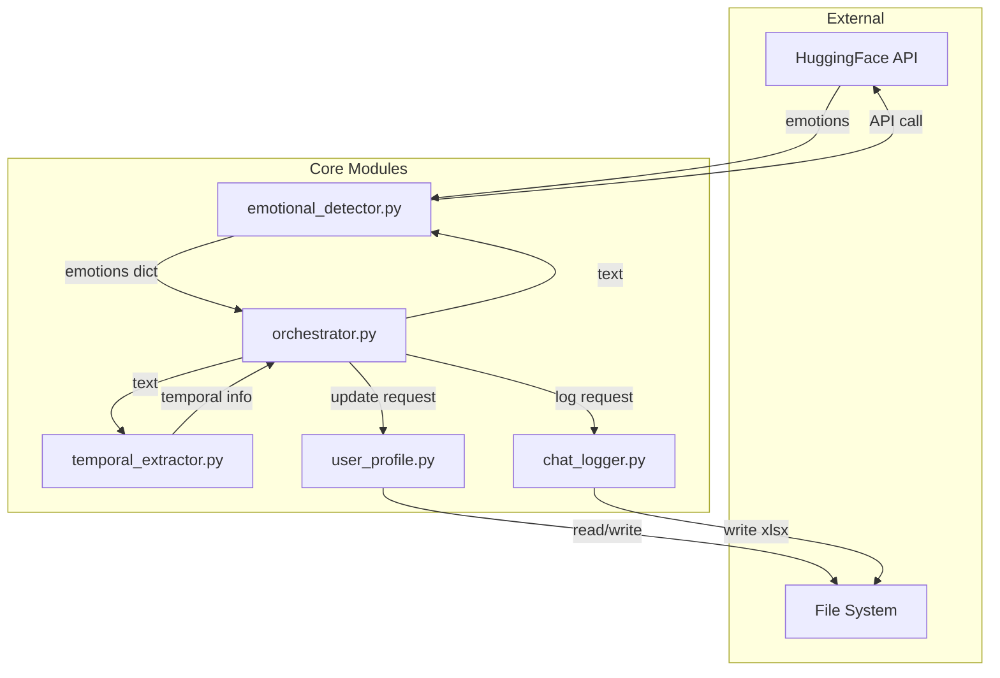

# 06 — Module Reference

> **Prerequisites:** [05-core-concepts.md](./05-core-concepts.md)  
> **Next:** [07-api-reference.md](./07-api-reference.md)

---

## Overview

This document provides detailed documentation for each Python file in the module.

| File | Lines | Purpose |
|------|-------|---------|
| `orchestrator.py` | 796 | Central coordinator |
| `emotional_detector.py` | 115 | Emotion classification |
| `temporal_extractor.py` | 929 | Time reference extraction |
| `user_profile.py` | 882 | Profile management |
| `chat_logger.py` | 217 | Excel logging |

---

# 1. orchestrator.py

## Purpose

The **brain** of the module. Coordinates all other components to process user messages and update emotional states.

## What It Does

1. Receives user messages
2. Extracts temporal references (via `temporal_extractor`)
3. Detects emotions (via `emotional_detector`)
4. Calculates impact weights
5. Updates user profile states (via `user_profile`)

---

## Key Components

### Class: `ImpactCalculator`

Calculates how much a message should influence each emotional state.

```python
class ImpactCalculator:
    def __init__(self, entropy_penalty=0.3, recurrence_step=0.3, behavior_alpha=0.2):
        self.entropy_penalty = entropy_penalty      # Penalty for ambiguous emotions
        self.recurrence_step = recurrence_step      # Boost for repeated emotions
        self.behavior_alpha = behavior_alpha        # Learning rate for behavior patterns
```

---

### Method: `calculate_recency_weight()`

Calculates how recent the referenced time is.

```python
def calculate_recency_weight(self, days_ago: int) -> float:
    """
    Maps temporal distance to weight.
    
    Args:
        days_ago: Number of days ago (negative = future)
    
    Returns:
        Weight between 0.0 and 1.0
    
    Examples:
        0 days    → 1.0  (very recent)
        30 days   → 0.7  (moderate)
        365 days  → 0.3  (old)
        1000 days → 0.1  (very old)
    """
```

---

### Method: `calculate_emotion_intensity()`

Aggregates emotion scores and detects dominant emotion.

```python
def calculate_emotion_intensity(self, emotions: Dict[str, float]) -> Tuple[float, str]:
    """
    Calculates overall intensity and dominant emotion.
    
    Args:
        emotions: Dict mapping emotion names to scores (0-1)
    
    Returns:
        (intensity_score, dominant_emotion_name)
    
    Example:
        emotions = {'joy': 0.8, 'excitement': 0.6, 'sadness': 0.1}
        → (0.8, 'joy')
    """
```

---

### Method: `calculate_recurrence_boost()`

Boosts emotions that appear repeatedly.

```python
def calculate_recurrence_boost(self, emotion: str, history: List[Dict]) -> float:
    """
    Increases weight for recurring emotions.
    
    Args:
        emotion: The emotion to check
        history: List of past emotion detections
    
    Returns:
        Boost multiplier (1.0 = no boost, up to ~2.0)
    
    Rule:
        Each recent occurrence adds recurrence_step (0.3)
    """
```

---

### Method: `get_state_impact_multipliers()`

Distributes impact across temporal states based on time category.

```python
def get_state_impact_multipliers(self, temporal_category: str) -> Dict[str, float]:
    """
    Maps temporal category to state impacts.
    
    Args:
        temporal_category: 'recent', 'medium', 'distant', 'future'
    
    Returns:
        Dict with 'ST', 'MT', 'LT' multipliers
    
    Mappings:
        'recent'  → {'ST': 0.7, 'MT': 0.2, 'LT': 0.1}
        'medium'  → {'ST': 0.3, 'MT': 0.5, 'LT': 0.2}
        'distant' → {'ST': 0.05, 'MT': 0.3, 'LT': 0.8}
        'future'  → {'ST': 0.7, 'MT': 0.4, 'LT': 0.0}
    """
```

---

### Function: `process_message()`

Main entry point for message processing.

```python
def process_message(
    user_id: str,
    message: str,
    timestamp: datetime = None
) -> Dict:
    """
    Processes a user message end-to-end.
    
    Args:
        user_id: Unique user identifier
        message: The message text
        timestamp: When message was sent (default: now)
    
    Returns:
        {
            'detected_emotions': {...},
            'temporal_refs': [...],
            'state_updates': {...},
            'dominant_emotion': str
        }
    
    Flow:
        1. temporal_extractor.extract(message) → time refs
        2. emotional_detector.classify_emotions(message) → emotions
        3. calculate impact weights
        4. user_profile.update_states(...) → updated states
    """
```

---

## Configuration Constants

```python
# Impact calculation
ENTROPY_PENALTY = 0.3       # Reduces confidence for ambiguous emotions
RECURRENCE_STEP = 0.3       # Boost per recent recurrence
BEHAVIOR_ALPHA = 0.2        # Behavioral pattern learning rate

# Temporal mapping
RECENT_DAYS = 30            # Days considered "recent"
MEDIUM_DAYS = 365           # Days considered "medium"
DISTANT_DAYS = 1825         # Days considered "distant" (5 years)
```

---

# 2. emotional_detector.py

## Purpose

Wrapper for the HuggingFace emotion classification API. Converts text into emotion scores.

## What It Does

1. Sends text to HuggingFace API
2. Receives 27-emotion classification
3. Returns normalized scores

---

## External API

| Property | Value |
|----------|-------|
| Provider | HuggingFace Inference API |
| Model | `AnasAlokla/multilingual_go_emotions` |
| Capability | 27-emotion classification |
| Languages | English, Hindi, Hinglish |

---

### Function: `classify_emotions()`

Main function for emotion detection.

```python
def classify_emotions(text: str) -> Dict[str, float]:
    """
    Classifies emotions in text using HuggingFace API.
    
    Args:
        text: The input text (supports EN, HI, Hinglish)
    
    Returns:
        Dict mapping 27 emotions to scores (0.0 - 1.0)
    
    Example:
        classify_emotions("I'm so happy today!")
        → {
            'joy': 0.85,
            'excitement': 0.42,
            'optimism': 0.38,
            'love': 0.12,
            ...  # 23 more emotions
        }
    """
```

---

## The 27 Emotions

```python
ALL_EMOTIONS = [
    'admiration', 'amusement', 'anger', 'annoyance', 'approval',
    'caring', 'confusion', 'curiosity', 'desire', 'disappointment',
    'disapproval', 'disgust', 'embarrassment', 'excitement', 'fear',
    'gratitude', 'grief', 'joy', 'love', 'nervousness',
    'optimism', 'pride', 'realization', 'relief', 'remorse',
    'sadness', 'surprise'
]
```

---

## Error Handling

```python
def classify_emotions(text: str) -> Dict[str, float]:
    try:
        response = requests.post(API_URL, headers=HEADERS, json={"inputs": text})
        response.raise_for_status()
        return parse_response(response.json())
    except requests.RequestException as e:
        # Return neutral scores on API failure
        return {emotion: 0.0 for emotion in ALL_EMOTIONS}
```

---

# 3. temporal_extractor.py

## Purpose

Extracts time references from multilingual text and categorizes them into temporal buckets.

## What It Does

1. Parses text for time phrases ("3 years ago", "कल", "next week")
2. Calculates days relative to current date
3. Categorizes into: recent, medium, distant, future

---

## Key Data Classes

### `TimePhrase`

```python
@dataclass
class TimePhrase:
    original_text: str      # "तीन साल पहले"
    normalized: str         # "3 years ago"
    start_pos: int          # Character position in text
    end_pos: int            # End position
    confidence: float       # 0.0 - 1.0
```

### `ParsedTemporal`

```python
@dataclass
class ParsedTemporal:
    phrases: List[TimePhrase]
    days_ago: int           # -7 (future) to 36500+ (distant)
    category: str           # 'recent', 'medium', 'distant', 'future'
    tense: str              # 'past', 'present', 'future'
```

---

## Class: `TenseAnalyzer`

Grammatical tense detection for Hindi/English.

```python
class TenseAnalyzer:
    def analyze(self, text: str) -> str:
        """
        Detects grammatical tense.
        
        Args:
            text: Input text
        
        Returns:
            'past', 'present', or 'future'
        
        Patterns:
            English past: 'was', 'were', 'had', '-ed'
            Hindi past: 'था', 'थी', 'थे', 'गया'
            English future: 'will', 'going to', 'shall'
            Hindi future: 'गा', 'गी', 'गे'
        """
```

---

## Temporal Categories

```python
def categorize_temporal(days_ago: int) -> str:
    """
    Maps days to category.
    
    Ranges:
        future:  days_ago < 0
        recent:  0 <= days_ago <= 30
        medium:  31 <= days_ago <= 365
        distant: days_ago > 365
    """
```

---

## Supported Time Patterns

### English

| Pattern | Example | Days |
|---------|---------|------|
| Relative | "3 days ago" | 3 |
| Named | "last Monday" | varies |
| Approximate | "about a week ago" | 7 |
| Absolute | "in 2019" | ~1800 |

### Hindi / Hinglish

| Pattern | Example | Days |
|---------|---------|------|
| कल/परसों | "कल" (yesterday) | 1 |
| Duration | "तीन महीने पहले" | 90 |
| Relative | "पिछले हफ्ते" | 7 |

---

### Function: `extract()`

Main extraction function.

```python
def extract(text: str) -> ParsedTemporal:
    """
    Extracts temporal information from text.
    
    Args:
        text: Multilingual input text
    
    Returns:
        ParsedTemporal object with:
        - phrases: All detected time phrases
        - days_ago: Primary temporal reference
        - category: recent/medium/distant/future
        - tense: past/present/future
    
    Example:
        extract("3 years ago I lost my job")
        → ParsedTemporal(
            phrases=[TimePhrase("3 years ago", ...)],
            days_ago=1095,
            category='distant',
            tense='past'
        )
    """
```

---

# 4. user_profile.py

## Purpose

Manages user emotional profiles with three temporal states and adaptive learning.

## What It Does

1. Stores emotional states (ST, MT, LT)
2. Updates states using EMA
3. Handles profile persistence (JSON)
4. Manages state activation thresholds

---

## Class: `UserProfile`

Main profile management class.

```python
class UserProfile:
    def __init__(self, user_id: str):
        self.user_id = user_id
        self.created_at = datetime.now()
        self.message_count = 0
        
        # Three temporal states (27 emotions each)
        self.short_term_state = {e: 0.0 for e in ALL_EMOTIONS}
        self.mid_term_state = {e: 0.0 for e in ALL_EMOTIONS}
        self.long_term_state = {e: 0.0 for e in ALL_EMOTIONS}
        
        # State activation flags
        self.mt_activated = False
        self.lt_activated = False
```

---

## Configuration Constants

### ALL_EMOTIONS

```python
ALL_EMOTIONS = [
    'admiration', 'amusement', 'anger', 'annoyance', 'approval',
    'caring', 'confusion', 'curiosity', 'desire', 'disappointment',
    'disapproval', 'disgust', 'embarrassment', 'excitement', 'fear',
    'gratitude', 'grief', 'joy', 'love', 'nervousness',
    'optimism', 'pride', 'realization', 'relief', 'remorse',
    'sadness', 'surprise'
]  # 27 emotions
```

### STATE_ACTIVATION_CONFIG

```python
STATE_ACTIVATION_CONFIG = {
    'mid_term': {
        'min_days': 14,          # 2 weeks
        'min_messages': 30
    },
    'long_term': {
        'min_days': 90,          # 3 months
        'min_messages': 50
    }
}
```

### INITIAL_WEIGHTS (Learning Rates)

```python
INITIAL_WEIGHTS = {
    'short_term': 0.15,   # Fast adaptation
    'mid_term': 0.10,     # Moderate (rolling window actually)
    'long_term': 0.02     # Slow, stable
}
```

---

### Method: `update_states()`

Core EMA update logic.

```python
def update_states(
    self,
    emotions: Dict[str, float],
    impact_multipliers: Dict[str, float]
) -> Dict[str, Dict[str, float]]:
    """
    Updates all emotional states with new emotion data.
    
    Args:
        emotions: Detected emotions from message
        impact_multipliers: {'ST': 0.7, 'MT': 0.2, 'LT': 0.1}
    
    Returns:
        Updated states for all three temporal horizons
    
    Process:
        1. Check state activation thresholds
        2. Apply EMA formula for each active state
        3. Increment message count
        4. Save to disk
    """
```

---

### Method: `check_activation()`

Determines which states should be active.

```python
def check_activation(self) -> None:
    """
    Activates states based on thresholds.
    
    Rules:
        MT: (days >= 14) OR (messages >= 30)
        LT: (days >= 90) OR (messages >= 50)
    """
    days_active = (datetime.now() - self.created_at).days
    
    if days_active >= 14 or self.message_count >= 30:
        self.mt_activated = True
    
    if days_active >= 90 or self.message_count >= 50:
        self.lt_activated = True
```

---

### Method: `get_dominant_emotions()`

Returns top emotions for each state.

```python
def get_dominant_emotions(self, top_n: int = 5) -> Dict[str, List[Tuple[str, float]]]:
    """
    Gets top emotions for each temporal state.
    
    Returns:
        {
            'short_term': [('joy', 0.8), ('excitement', 0.6), ...],
            'mid_term': [('stress', 0.5), ('determination', 0.4), ...],
            'long_term': [('resilience', 0.3), ('hope', 0.25), ...]
        }
    """
```

---

### Method: `_adapt_weights_based_on_pattern()`

Adapts SS weights based on user's emotional patterns during conversation.

```python
def _adapt_weights_based_on_pattern(self, state_type: str) -> Dict[str, float]:
    """
    Adapts SS calculation weights based on user's emotional history.
    
    Args:
        state_type: 'short_term', 'mid_term', or 'long_term'
    
    Returns:
        Adapted weights dict (normalized to sum=1.0)
    
    Process:
        1. Get recent emotion history for the state
        2. Calculate volatility from history
        3. Adjust weights based on patterns:
           - High volatility → ↑ volatility weight, ↓ persistence
           - Low volatility → ↑ persistence weight, ↓ volatility
        4. Normalize weights to ensure sum = 1.0
    
    Constraints:
        - MIN_WEIGHT = 0.10
        - MAX_WEIGHT = 0.30
        - Requires at least 3 messages for adaptation
    """
```

**Why Adaptive Weights?**

| Benefit | Explanation |
|---------|-------------|
| **Personalization** | SS calculation tailored to user's pattern |
| **Better predictions** | System learns what matters for each user |
| **Self-correcting** | Adjusts as patterns change over time |

---

## Persistence

Profiles are stored as JSON in `user_profiles/` directory:

```json
{
    "user_id": "user123",
    "created_at": "2024-01-15T10:30:00",
    "message_count": 127,
    "short_term_state": {
        "joy": 0.45,
        "sadness": 0.12,
        ...
    },
    "mid_term_state": {...},
    "long_term_state": {...},
    "mt_activated": true,
    "lt_activated": true
}
```

---

# 5. chat_logger.py

## Purpose

Logs chat interactions and emotional states to Excel files for analysis and debugging.

## What It Does

1. Creates/updates Excel workbooks
2. Logs each message with emotions and states
3. Formats for easy analysis

---

## Dependencies

```python
import openpyxl
from openpyxl.styles import Font, Alignment, PatternFill
```

---

### Function: `log_interaction()`

Main logging function.

```python
def log_interaction(
    user_id: str,
    message: str,
    detected_emotions: Dict[str, float],
    temporal_category: str,
    state_updates: Dict[str, Dict[str, float]],
    timestamp: datetime = None
) -> str:
    """
    Logs a single interaction to Excel.
    
    Args:
        user_id: User identifier
        message: The message text
        detected_emotions: All 27 emotion scores
        temporal_category: recent/medium/distant/future
        state_updates: Updated ST/MT/LT states
        timestamp: When message was processed
    
    Returns:
        Path to the Excel file
    """
```

---

## Excel Structure

### Sheet: "Interactions"

| Column | Content |
|--------|---------|
| A | Timestamp |
| B | Message |
| C | Temporal Category |
| D | Dominant Emotion |
| E | Emotion Score |
| F-? | All 27 emotions |

### Sheet: "State History"

| Column | Content |
|--------|---------|
| A | Timestamp |
| B | State Type (ST/MT/LT) |
| C-? | All 27 emotion values |

---

## File Organization

```
user_profiles/
├── user123.json           # Profile data
├── user123_chat_log.xlsx  # Chat log
├── user456.json
└── user456_chat_log.xlsx
```

---

## Styling

```python
# Header styling
header_font = Font(bold=True, color="FFFFFF")
header_fill = PatternFill("solid", fgColor="4472C4")

# High emotion highlighting
high_emotion_fill = PatternFill("solid", fgColor="FFFF00")  # Yellow
```

---

# Module Interaction Map



---

## What's Next?

Now let's look at the API reference for all public functions:

👉 **Continue to [07-api-reference.md](./07-api-reference.md)** for function signatures and parameters.

---

**Navigation:**
| Previous | Current | Next |
|----------|---------|------|
| [05-core-concepts.md](./05-core-concepts.md) | 06-module-reference.md | [07-api-reference.md](./07-api-reference.md) |
