# 09 — Diagrams

> **Reading time:** 10 minutes (visual reference)  
> **Prerequisites:** [01-introduction.md](./01-introduction.md)  

---

## Overview

This document contains all Mermaid diagrams from the module documentation, consolidated for easy reference.

---

# System Architecture

## High-Level Architecture

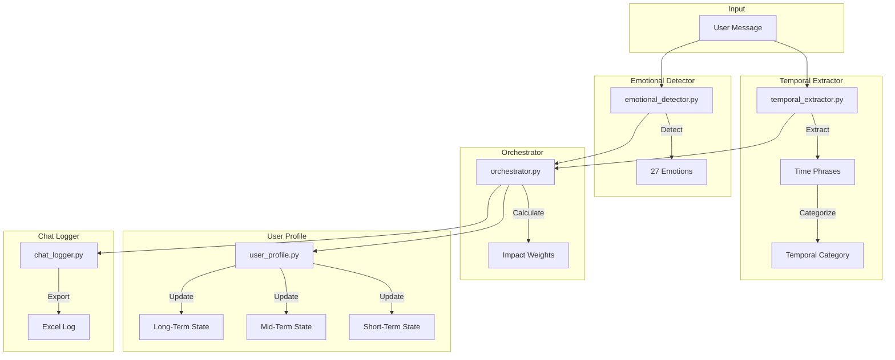

---

## Component Interaction

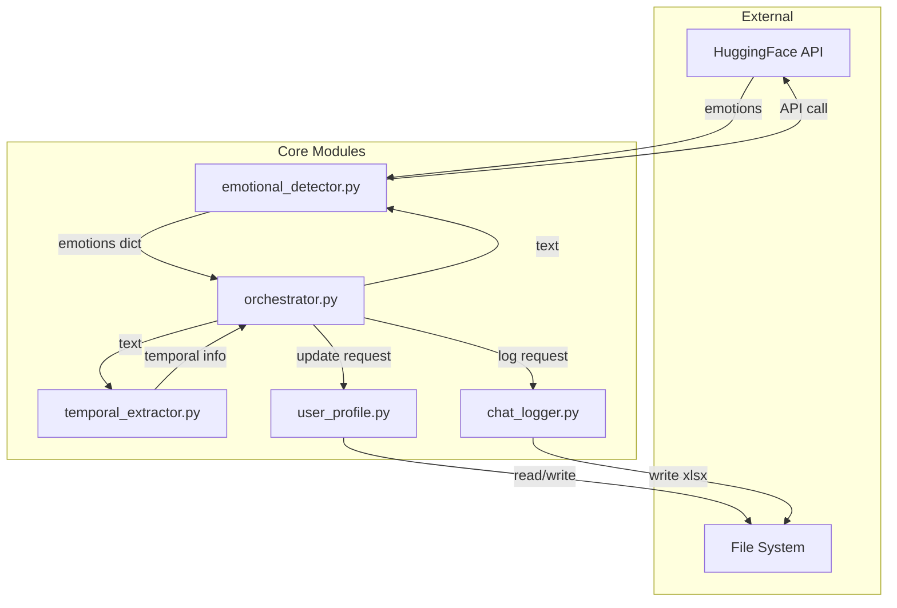

---

# Data Flow

## Message Processing Pipeline

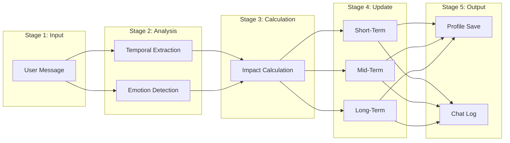

---

## State Update Flow

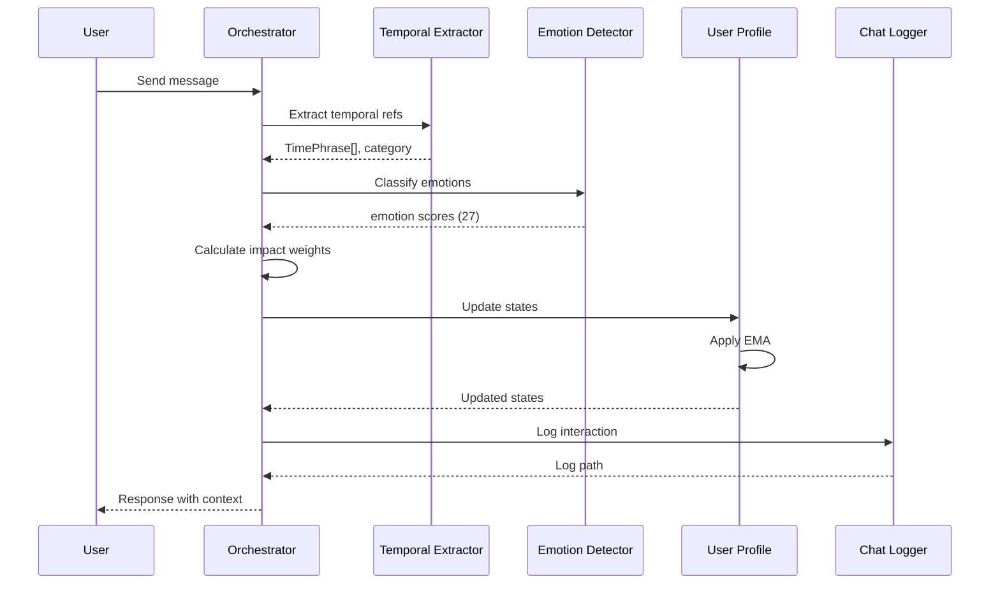

---

# State Management

## State Activation Flow

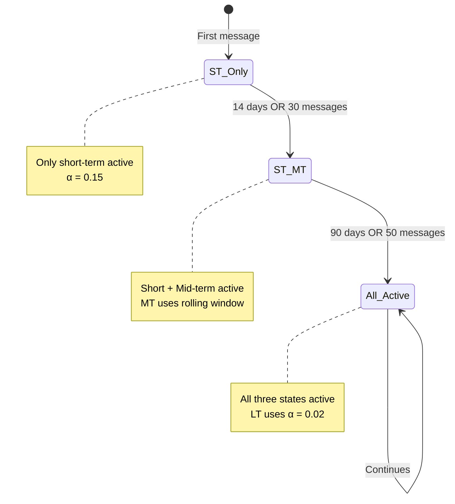

---

## Temporal Category Impact Distribution

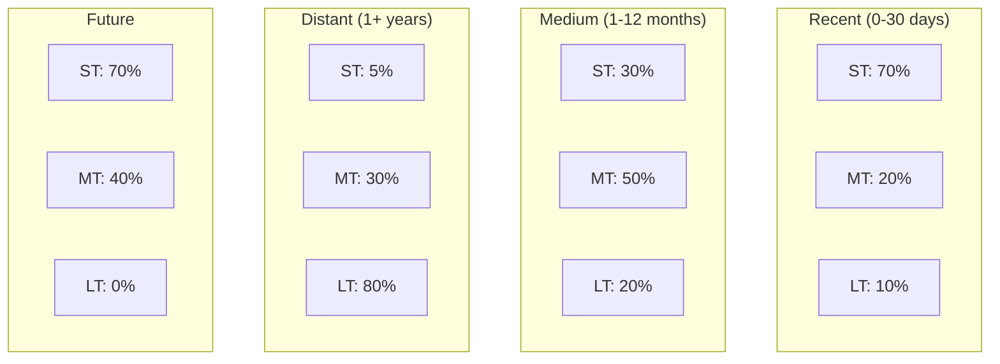

---

## EMA State Evolution

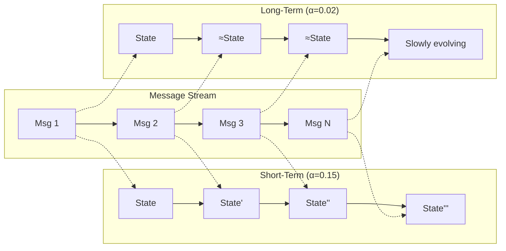

---

# User Interaction

## Complete User Flow

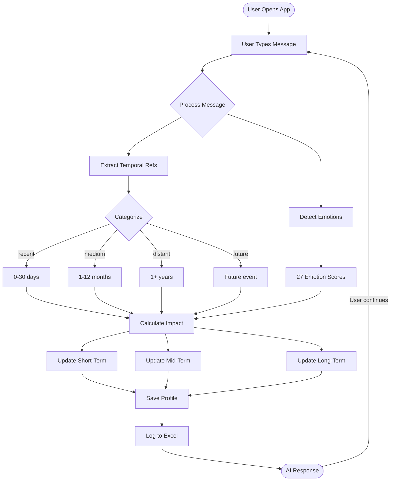

---

## Profile Lifecycle

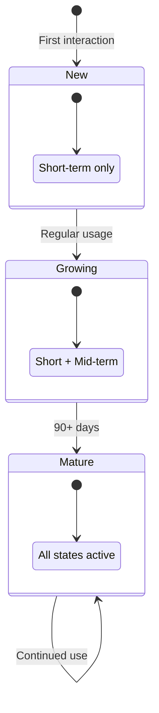

---

# Entity Relationships

## Data Model

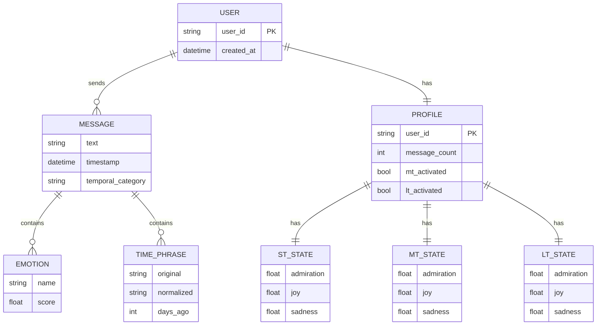

---

# Algorithm Visualization

## EMA Formula

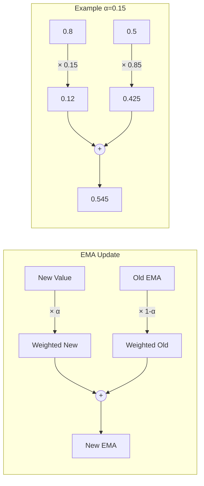

---

## PRISM Scoring

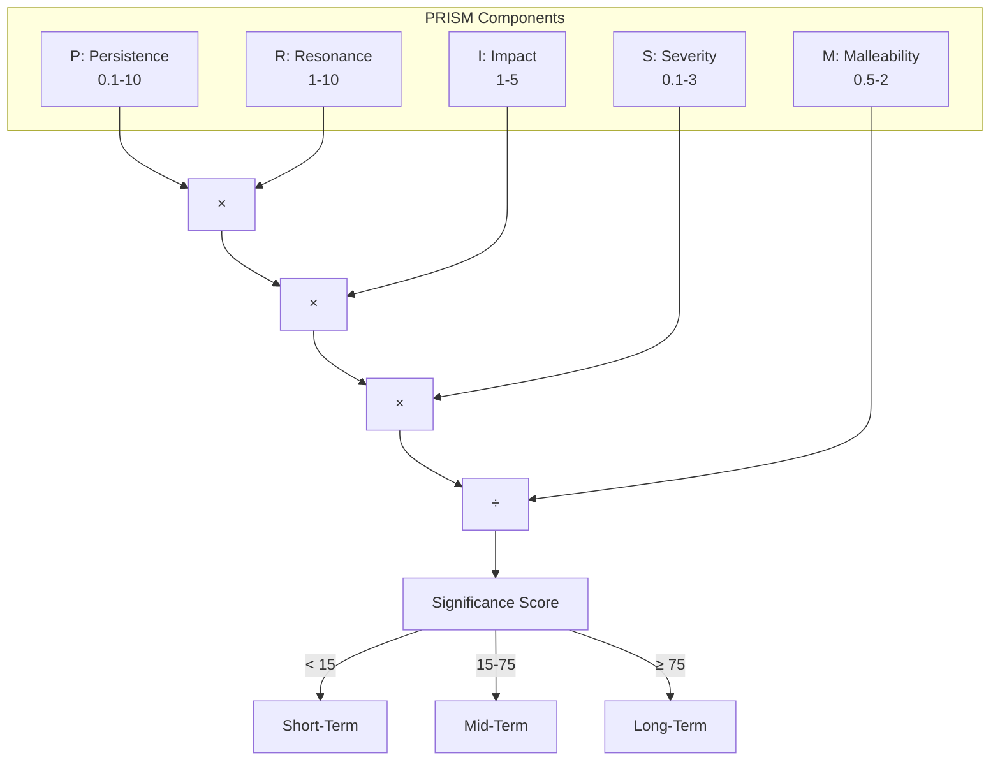

---

## Decay Curves

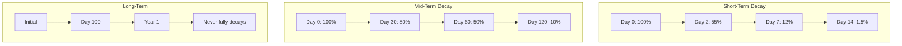

---

# File Dependencies

## Import Graph

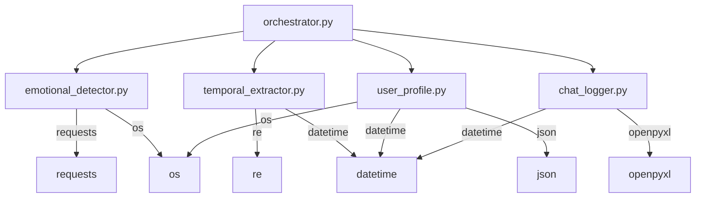

---

## Directory Structure

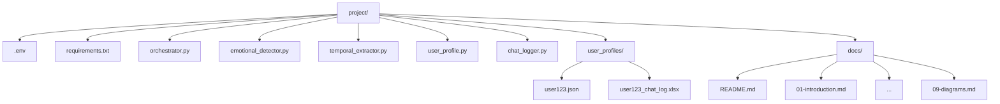

---

# Quick Reference

## All Diagrams Index

| Diagram | Section | Purpose |
|---------|---------|---------|
| High-Level Architecture | [Architecture](#high-level-architecture) | System overview |
| Component Interaction | [Architecture](#component-interaction) | Module connections |
| Message Pipeline | [Data Flow](#message-processing-pipeline) | Processing stages |
| State Update Sequence | [Data Flow](#state-update-flow) | Step-by-step flow |
| State Activation | [State Management](#state-activation-flow) | When states activate |
| Impact Distribution | [State Management](#temporal-category-impact-distribution) | Category → State mapping |
| EMA Evolution | [State Management](#ema-state-evolution) | How states change |
| User Flow | [User Interaction](#complete-user-flow) | End-to-end user journey |
| Profile Lifecycle | [User Interaction](#profile-lifecycle) | Profile maturity |
| Data Model | [Entity Relationships](#data-model) | ER diagram |
| EMA Formula | [Algorithms](#ema-formula) | Math visualization |
| PRISM Scoring | [Algorithms](#prism-scoring) | Score calculation |
| Decay Curves | [Algorithms](#decay-curves) | Time-based decay |
| Import Graph | [Dependencies](#import-graph) | Module imports |
| Directory Structure | [Dependencies](#directory-structure) | File organization |

---

**Navigation:**
| Previous | Current | Home |
|----------|---------|------|
| [08-configuration.md](./08-configuration.md) | 09-diagrams.md | [README.md](./README.md) |
