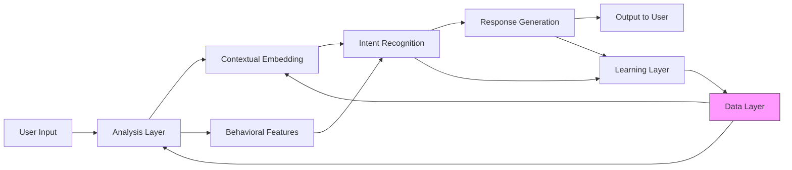
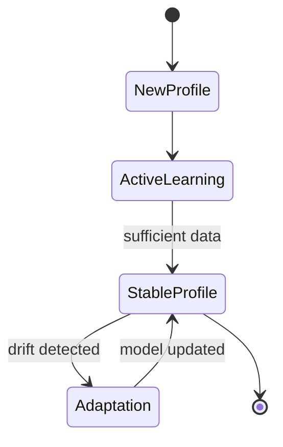

# Architecture Guide

> **Emotional State Analysis Module** — System Design Documentation

---

## Table of Contents

1. [System Overview](#system-overview)
2. [Component Architecture](#component-architecture)
3. [Data Flow Pipeline](#data-flow-pipeline)
4. [State Management](#state-management)
5. [Storage Architecture](#storage-architecture)
6. [Integration Points](#integration-points)

---

## System Overview

The Emotional State Analysis Module is designed as a modular, extensible system for real-time emotional state tracking. The architecture follows these principles:

- **Separation of Concerns**: Each module has a single, well-defined responsibility
- **Loose Coupling**: Modules communicate through well-defined interfaces
- **Adaptive Learning**: EMA-based parameters evolve based on user behavior
- **Multi-temporal Analysis**: Tracks emotions across three time horizons

### High-Level Architecture



---

## Component Architecture

### Core Components

#### 1. Orchestrator (`orchestrator.py`)

The central coordination layer that:
- Receives user messages
- Coordinates emotion detection and temporal extraction
- Calculates compound impact scores
- Updates user profiles
- Manages adaptive weight learning

**Key Classes:**
- `ImpactCalculator`: Calculates emotional impact using weighted sum approach
- `BehaviorMultiplier`: Adjusts impact based on typing behavior

**Key Methods:**
- `calculate_recency_weight()`: Exponential decay for past events
- `calculate_emotion_intensity()`: Normalized intensity with entropy penalty
- `calculate_recurrence_boost()`: Repetition amplification

#### 2. Emotional Detector (`emotional_detector.py`)

Handles emotion classification using the HuggingFace Inference API:
- Model: `AnasAlokla/multilingual_go_emotions`
- Supports 27 emotions
- Multilingual: English, Hindi, Hinglish

**Key Functions:**
- `classify_emotions(text)`: Returns `{emotion: probability}` dictionary

#### 3. Temporal Extractor (`temporal_extractor.py`)

Extracts and parses temporal references from text:
- 40+ regex patterns for multiple languages
- Category classification: recent, medium, distant, future
- Confidence scoring

**Key Classes:**
- `TemporalExtractor`: Main extraction orchestrator
- `TimePhrase`: Detected temporal phrase representation
- `ParsedTemporal`: Parsed temporal reference with metadata
- `TenseAnalyzer`: Verb tense analysis for ambiguity resolution

#### 4. User Profile (`user_profile.py`)

Manages per-user emotional profiles:
- Three temporal states (ST, MT, LT)
- Adaptive weights for impact calculation
- Message history tracking
- JSON persistence

**Key Classes:**
- `UserProfile`: Main profile management class

**Key Constants:**
- `ALL_EMOTIONS`: List of 27 supported emotions
- `INITIAL_WEIGHTS`: Default adaptive weight hierarchy
- `STATE_ACTIVATION_CONFIG`: Activation thresholds

#### 5. Chat Logger (`chat_logger.py`)

Excel export functionality for chat analysis:
- Creates formatted Excel workbooks
- Logs messages with emotional states
- Tracks profile evolution over time

**Key Classes:**
- `ChatLogger`: Excel logging management

---

## Data Flow Pipeline

### Message Processing Flow

```
User Message
    │
    ├──► Emotion Detection (HuggingFace)
    │       → 27 emotions with probability scores
    │
    ├──► Temporal Extraction (Regex + dateparser)
    │       → Time phrases with days_ago and confidence
    │
    ├──► Impact Calculation
    │       → Weighted sum of: intensity + recency + recurrence + confidence
    │
    └──► Profile Update (EMA)
            → Short-term (α=0.15, fast)
            → Mid-term (rolling 15-message window)
            → Long-term (α=0.02, slow)
```

### Impact Calculation Formula

The compound impact score is calculated as:

```python
base_impact = (w_ei × emotion_intensity) +
              (w_rw × recency_weight) +
              (w_tc × temporal_confidence) +
              (w_rb × normalized_recurrence)

final_impact = base_impact × behavior_multiplier
```

Where weights follow the hierarchy:
- `w_ei` (emotion_intensity): 0.45 — highest priority
- `w_rw` (recency_weight): 0.30 — high priority
- `w_rb` (recurrence_boost): 0.15 — medium priority
- `w_tc` (temporal_confidence): 0.10 — lowest priority

---

## State Management

### Three Temporal States

| State | Time Horizon | Activation | Learning Rate | Purpose |
|-------|--------------|------------|---------------|---------|
| **Short-Term (ST)** ⚡ | 0-30 days | Always | α = 0.15 | Current mood |
| **Mid-Term (MT)** 📈 | 31-365 days | 14d OR 30 msgs | Rolling window | Emotional trends |
| **Long-Term (LT)** 🏛️ | 365+ days | 90d OR 50 msgs | α = 0.02 | Personality baseline |

### EMA Update Formula

```
State(t) = α × NewEmotion + (1 - α) × State(t-1)
```

### State Evolution Diagram



### Adaptive Learning Rate

As profiles mature, the learning rate decreases:

```python
effective_α = base_α / (1 + message_count / decay_constant)
```

This stabilizes profiles over time while remaining responsive to significant changes.

---

## Storage Architecture

### Profile Storage (JSON)

User profiles are persisted as JSON files in `user_profiles/`:

```json
{
  "user_id": "username",
  "created_at": "2026-02-17T10:00:00",
  "short_term_state": {"sadness": 0.4, "joy": 0.2, ...},
  "mid_term_state": {"sadness": 0.3, "joy": 0.25, ...},
  "long_term_state": {"neutral": 0.35, "joy": 0.15, ...},
  "adaptive_weights": {...},
  "message_history": [...],
  "message_count": 150
}
```

### Chat Logs (Excel)

Chat logs are stored in `chat_logs.xlsx` with columns:
- Timestamp
- Message
- Impact Score
- Current ST/MT/LT emotions
- Profile ST/MT/LT emotions
- State activation status
- Profile metadata

---

## Integration Points

### Input Integration

The module can receive input from:
- Interactive terminal (`test_orchestrator.py`)
- Automated testing (`auto_test.py`)
- External applications via `orchestrator.process_user_message()`

### Output Integration

The module provides:
- `IncidentAnalysis` dataclass with full analysis results
- Updated `UserProfile` with emotional states
- Excel logs for external analysis
- JSON exports for integration with other systems

### API Surface

```python
from orchestrator import ImpactCalculator, process_user_message
from emotional_detector import classify_emotions
from temporal_extractor import TemporalExtractor
from user_profile import UserProfile, ALL_EMOTIONS
from chat_logger import ChatLogger
```

---

## Next Steps

- [API Reference](./api-reference.md) — Detailed function documentation
- [Data Flow](./data-flow.md) — Complete data pipeline documentation
- [Configuration](./configuration.md) — Environment and parameter setup
