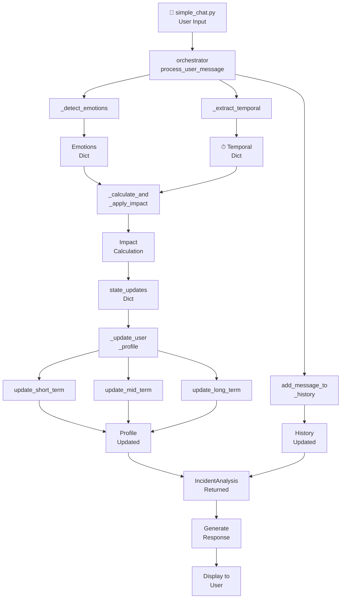

# Data Flow Documentation

> **Emotional State Analysis Module** — Complete Data Pipeline Documentation

---

## Table of Contents

1. [Overview](#overview)
2. [Message Processing Pipeline](#message-processing-pipeline)
3. [Emotion Detection Flow](#emotion-detection-flow)
4. [Temporal Extraction Flow](#temporal-extraction-flow)
5. [Impact Calculation Flow](#impact-calculation-flow)
6. [State Update Flow](#state-update-flow)
7. [Data Persistence](#data-persistence)

---

## Overview

The data flow through the Emotional State Analysis Module follows a structured pipeline from user input to state updates and persistence.

```
User Message
     │
     ▼
┌─────────────────┐     ┌─────────────────┐
│ Emotion         │     │ Temporal        │
│ Detection       │     │ Extraction      │
└────────┬────────┘     └────────┬────────┘
         │                       │
         └───────────┬───────────┘
                     │
                     ▼
            ┌─────────────────┐
            │ Impact          │
            │ Calculation     │
            └────────┬────────┘
                     │
                     ▼
            ┌─────────────────┐
            │ State Updates   │
            │ (ST/MT/LT)      │
            └────────┬────────┘
                     │
         ┌───────────┴───────────┐
         │                       │
         ▼                       ▼
┌─────────────────┐     ┌─────────────────┐
│ JSON Profile    │     │ Excel Logs      │
│ Persistence     │     │ Export          │
└─────────────────┘     └─────────────────┘
```

---

## Message Processing Pipeline

### Input Stage

```python
# User input
message = "3 saal pehle dadi chali gayi, aaj bhi yaad aati hai"

# Optional metadata
typing_speed = 4.5  # characters per second
timestamp = datetime.now()
```

### Processing Stage



### Output Stage

```python
# IncidentAnalysis result
{
    "emotions": {"sadness": 0.72, "grief": 0.15, ...},
    "temporal": {"days_ago": 1095, "category": "distant"},
    "impact_score": 0.85,
    "state_updates": {
        "short_term": {"sadness": 0.45, ...},
        "mid_term": {"sadness": 0.35, ...},
        "long_term": {"sadness": 0.25, ...}
    }
}
```

---

## Emotion Detection Flow

### Input → Output

```
Input: "3 saal pehle dadi chali gayi, aaj bhi yaad aati hai"
                              │
                              ▼
                    ┌─────────────────┐
                    │ HuggingFace API │
                    │ text_classification │
                    └────────┬────────┘
                              │
                              ▼
Output: {
    "sadness": 0.72,
    "grief": 0.15,
    "love": 0.08,
    "caring": 0.03,
    "neutral": 0.01,
    ...
}
```

### Processing Steps

1. **Text Preprocessing**
   - Check for empty/null input
   - Trim whitespace

2. **API Call**
   - Send text to HuggingFace Inference API
   - Model: `AnasAlokla/multilingual_go_emotions`

3. **Response Processing**
   - Parse JSON response
   - Convert to dictionary format
   - Sort by probability (descending)

### Data Structure

```python
# Emotion detection output
emotions: Dict[str, float] = {
    "emotion_name": probability,  # 0.0 to 1.0
    ...
}
# Contains all 27 emotions
# Sum of probabilities ≈ 1.0
```

---

## Temporal Extraction Flow

### Input → Output

```
Input: "3 saal pehle dadi chali gayi"
                    │
                    ▼
         ┌─────────────────────┐
         │ Regex Pattern Match │
         └──────────┬──────────┘
                    │
                    ▼
         ┌─────────────────────┐
         │ dateparser.parse()  │
         └──────────┬──────────┘
                    │
                    ▼
         ┌─────────────────────┐
         │ TenseAnalyzer       │
         └──────────┬──────────┘
                    │
                    ▼
Output: ParsedTemporal(
    phrase="3 saal pehle",
    days_ago=1095,
    age_category="distant",
    confidence=0.95
)
```

### Processing Steps

1. **Pattern Matching**
   - Apply 40+ regex patterns
   - Match Hindi, English, Hinglish expressions

2. **Date Parsing**
   - Use `dateparser` for absolute dates
   - Calculate days from today

3. **Tense Analysis**
   - Analyze verb tenses for ambiguity
   - Resolve "kal" (yesterday/tomorrow)

4. **Categorization**
   - Classify: recent, medium, distant, future
   - Calculate confidence score

### Data Structure

```python
@dataclass
class ParsedTemporal:
    phrase: str                    # "3 saal pehle"
    parsed_date: Optional[datetime] # 2023-02-19
    time_gap_days: Optional[int]   # 1095
    age_category: str              # "distant"
    confidence: float              # 0.95
    parse_method: str              # "regex"
    days_ago: int                  # 1095
```

---

## Impact Calculation Flow

### Formula Pipeline

```
┌─────────────────────────────────────────────────────────┐
│                 IMPACT CALCULATION                       │
├─────────────────────────────────────────────────────────┤
│                                                          │
│  ┌─────────────────┐                                    │
│  │ Emotion Intensity│                                    │
│  │ = max_prob × (1 - entropy_penalty)                   │
│  └────────┬────────┘                                    │
│           │ × w_ei (0.45)                               │
│           ▼                                             │
│  ┌─────────────────┐                                    │
│  │ Recency Weight  │                                    │
│  │ = e^(λ × days)  │                                    │
│  └────────┬────────┘                                    │
│           │ × w_rw (0.30)                               │
│           ▼                                             │
│  ┌─────────────────┐                                    │
│  │ Temporal Conf.  │                                    │
│  │ = confidence    │                                    │
│  └────────┬────────┘                                    │
│           │ × w_tc (0.10)                               │
│           ▼                                             │
│  ┌─────────────────┐                                    │
│  │ Recurrence Boost│                                    │
│  │ = 1 + (n-1)×0.3 │                                    │
│  └────────┬────────┘                                    │
│           │ × w_rb (0.15)                               │
│           ▼                                             │
│  ═══════════════════                                    │
│        SUM = base_impact                                │
│  ═══════════════════                                    │
│           │                                             │
│           │ × behavior_multiplier                       │
│           ▼                                             │
│  ┌─────────────────┐                                    │
│  │ FINAL IMPACT    │                                    │
│  │ [0.0 - 1.0]     │                                    │
│  └─────────────────┘                                    │
│                                                          │
└─────────────────────────────────────────────────────────┘
```

### Calculation Steps

```python
# Step 1: Calculate emotion intensity
max_prob = max(emotions.values())  # 0.72
entropy = calculate_shannon_entropy(emotions)
entropy_penalty = max(0, entropy - 0.3)
emotion_intensity = max_prob * (1 - entropy_penalty)  # ~0.65

# Step 2: Calculate recency weight
lambda_factor = math.log(0.05) / 730
recency_weight = math.exp(lambda_factor * days_ago)  # ~0.10 for 1095 days

# Step 3: Get temporal confidence
temporal_confidence = parsed_temporal.confidence  # 0.95

# Step 4: Calculate recurrence boost
incident_count = count_similar_incidents()  # 1
recurrence_boost = 1 + (incident_count - 1) * 0.3  # 1.0
normalized_recurrence = (recurrence_boost - 1) / 1.5  # normalize to 0-1

# Step 5: Compute weighted sum
weights = profile.adaptive_weights
base_impact = (
    weights['emotion_intensity'] * emotion_intensity +      # 0.45 × 0.65
    weights['recency_weight'] * recency_weight +            # 0.30 × 0.10
    weights['temporal_confidence'] * temporal_confidence +  # 0.10 × 0.95
    weights['recurrence_boost'] * normalized_recurrence     # 0.15 × 0.0
)
# base_impact ≈ 0.42

# Step 6: Apply behavior multiplier
z_score = (typing_speed - mean) / std
behavior_multiplier = 1.0 + (0.2 * tanh(z_score))  # ~1.0
final_impact = base_impact * behavior_multiplier  # ~0.42
```

---

## State Update Flow

### Three-State Update Process

```
Final Impact Score: 0.42
Detected Emotions: {sadness: 0.72, grief: 0.15, ...}
Age Category: "distant"
         │
         ▼
┌─────────────────────────────────────────────────────────┐
│            STATE IMPACT MULTIPLIERS                      │
│  ┌─────────────────────────────────────────────────┐    │
│  │ Category: "distant"                              │    │
│  │   short_term: 0.05  │  mid_term: 0.30  │  long_term: 0.80  │
│  └─────────────────────────────────────────────────┘    │
└─────────────────────────────────────────────────────────┘
         │
         ▼
┌─────────────────────────────────────────────────────────┐
│  STATE UPDATES                                           │
│                                                          │
│  SHORT-TERM (α = 0.15)                                  │
│  ├── Multiplier: 0.05                                   │
│  ├── Effective Impact: 0.42 × 0.05 = 0.021              │
│  └── EMA: new_st = 0.15 × emotions + 0.85 × old_st      │
│                                                          │
│  MID-TERM (rolling window = 15)                         │
│  ├── Multiplier: 0.30                                   │
│  ├── Effective Impact: 0.42 × 0.30 = 0.126              │
│  └── Window average of last 15 messages                 │
│                                                          │
│  LONG-TERM (α = 0.02)                                   │
│  ├── Multiplier: 0.80                                   │
│  ├── Effective Impact: 0.42 × 0.80 = 0.336              │
│  └── EMA: new_lt = 0.02 × emotions + 0.98 × old_lt      │
│                                                          │
└─────────────────────────────────────────────────────────┘
```

### EMA Update Formula

```python
# For each emotion in state
for emotion in ALL_EMOTIONS:
    old_value = state[emotion]
    new_value = detected_emotions.get(emotion, 0.0)
    
    # Apply EMA with effective alpha
    effective_alpha = alpha * impact_multiplier
    state[emotion] = effective_alpha * new_value + (1 - effective_alpha) * old_value
```

---

## Data Persistence

### Profile Storage (JSON)

```
user_profiles/
├── user123.json
└── alice.json
```

**File Structure:**

```json
{
    "user_id": "user123",
    "created_at": "2026-02-01T10:00:00",
    "last_updated": "2026-02-19T14:30:00",
    "short_term_state": {
        "sadness": 0.45,
        "joy": 0.12,
        "neutral": 0.20,
        ...
    },
    "mid_term_state": {
        "sadness": 0.35,
        "neutral": 0.25,
        ...
    },
    "long_term_state": {
        "neutral": 0.40,
        "joy": 0.20,
        ...
    },
    "adaptive_weights": {
        "emotion_intensity": 0.47,
        "recency_weight": 0.28,
        "recurrence_boost": 0.16,
        "temporal_confidence": 0.09
    },
    "message_count": 150,
    "profile_age_days": 45,
    "message_history": [
        {
            "timestamp": "2026-02-19T14:30:00",
            "message": "Miss my grandmother",
            "emotions_detected": {...},
            "temporal_info": {...},
            "impact_score": 0.42
        },
        ...
    ]
}
```

### Chat Logs (Excel)

```
chat_logs.xlsx
├── Sheet: "Chat Logs"
│   ├── Headers (Row 1)
│   └── Data (Row 2+)
```

**Row Structure:**

| Column | Example Value |
|--------|---------------|
| Timestamp | 2026-02-19 14:30 |
| Message | Miss my grandmother |
| Impact Score | 0.42 |
| Current_ST_Emotion | sadness |
| Current_ST_Score | 0.72 |
| Current_MT_Emotion | sadness |
| Current_MT_Score | 0.45 |
| Current_LT_Emotion | neutral |
| Current_LT_Score | 0.35 |
| Profile_ST_Emotion | sadness |
| Profile_ST_Score | 0.45 |
| Profile_MT_Emotion | neutral |
| Profile_MT_Score | 0.30 |
| Profile_LT_Emotion | neutral |
| Profile_LT_Score | 0.40 |
| MT_Status | Active |
| LT_Status | N/A |
| Profile_Age_Days | 45 |
| Message_Count | 150 |

---

## Summary

The data flow follows a clear pipeline:

1. **Input** → User message with optional metadata
2. **Detection** → Parallel emotion and temporal extraction
3. **Calculation** → Weighted impact score computation
4. **Update** → EMA-based state updates across three horizons
5. **Persistence** → JSON profiles and Excel logs

Each stage transforms the data into a more processed form, ultimately updating the user's emotional profile and creating an audit trail for analysis.
