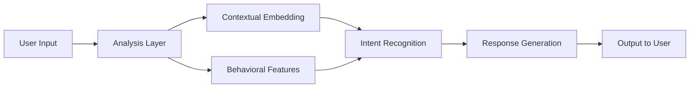
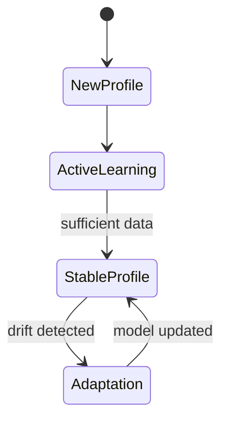

# Diagrams Index

> **Emotional State Analysis Module** — Visual Documentation

This folder contains all Mermaid diagrams extracted from the module documentation.

---

## Available Diagrams

| Diagram | Description | Source |
|---------|-------------|--------|
| [Architecture Diagram](./architecture-diagram.md) | High-level system data flow | `architecture.md` |
| [Sequence Diagram](./sequence-diagram.md) | Interaction cycle between components | `architecture.md` |
| [State Diagram](./state-diagram.md) | User profile evolution states | `architecture.md` |
| [Entity-Relationship Diagram](./entity-relationship-diagram.md) | Data storage structure | `architecture.md` |
| [State Management Flow](./state-management-flow.md) | Complete state pipeline with storage | `state_management.md` |
| [User Interaction Flow](./user-interaction-flow.md) | Message processing flow | `user_flow.md` |

---

## Diagram Types

### Flowcharts
Visual representation of data and control flow:
- [Architecture Diagram](./architecture-diagram.md)
- [State Management Flow](./state-management-flow.md)
- [User Interaction Flow](./user-interaction-flow.md)

### Sequence Diagrams
Time-ordered interaction between components:
- [Sequence Diagram](./sequence-diagram.md)

### State Diagrams
State machine representations:
- [State Diagram](./state-diagram.md)

### ER Diagrams
Database and storage structure:
- [Entity-Relationship Diagram](./entity-relationship-diagram.md)

---

## Rendering Mermaid Diagrams

These diagrams are written in [Mermaid](https://mermaid.js.org/) syntax and can be rendered:

1. **GitHub/GitLab**: Automatically rendered in Markdown files
2. **VS Code**: Use the "Markdown Preview Mermaid Support" extension
3. **Mermaid Live Editor**: [https://mermaid.live](https://mermaid.live)
4. **Documentation Tools**: Most modern doc tools support Mermaid

### VS Code Extension

Install the extension for live preview:
```
ext install bierner.markdown-mermaid
```

---

## Quick Reference

### Architecture Overview


### State Evolution


---

## Related Documentation

- [Documentation Overview](../documentation.md)
- [Architecture Guide](../architecture-guide.md)
- [Data Flow](../data-flow.md)
