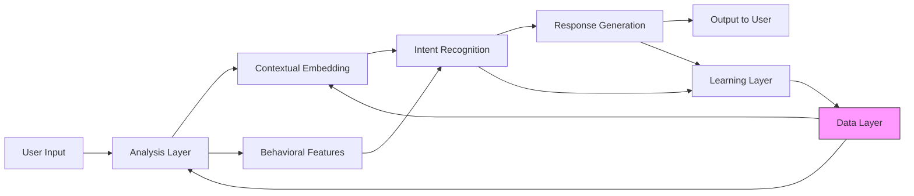

# System Architecture Diagram

This diagram illustrates the high-level data flow through the Emotional State Analysis Module.

## Description

| Component | Purpose |
|-----------|---------|
| **User Input** | Raw message from the user (text, typing metadata) |
| **Analysis Layer** | Performs emotion detection and temporal extraction |
| **Contextual Embedding** | Generates semantic representations of the message |
| **Behavioral Features** | Extracts typing speed, message length, and other behavioral signals |
| **Intent Recognition** | Classifies the emotional intent and temporal context |
| **Response Generation** | Produces appropriate responses based on emotional state |
| **Learning Layer** | Updates user profile and adaptive parameters |
| **Data Layer** | Persistent storage for profiles, history, and models |
