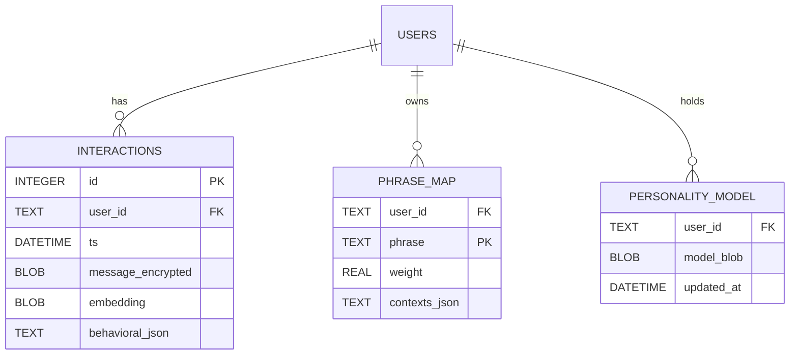

# Entity-Relationship Diagram (Storage)

This ER diagram shows the data storage structure for user profiles and interactions.

## Entity Descriptions

### USERS
The primary entity representing a unique user in the system.
- Identified by `user_id`
- Has relationships to interactions, phrase mappings, and personality models

### INTERACTIONS
Stores individual message interactions with emotional analysis.

| Field | Type | Description |
|-------|------|-------------|
| `id` | INTEGER | Primary key, auto-increment |
| `user_id` | TEXT | Foreign key to USERS |
| `ts` | DATETIME | Timestamp of interaction |
| `message_encrypted` | BLOB | Encrypted message content |
| `embedding` | BLOB | Vector embedding of message |
| `behavioral_json` | TEXT | JSON with typing speed, emotions, temporal data |

### PHRASE_MAP
Maps phrases to emotional weights for intent recognition.

| Field | Type | Description |
|-------|------|-------------|
| `user_id` | TEXT | Foreign key to USERS |
| `phrase` | TEXT | The detected phrase |
| `weight` | REAL | Emotional weight of phrase |
| `contexts_json` | TEXT | JSON array of contexts where phrase appeared |

### PERSONALITY_MODEL
Stores the user's evolved personality model.

| Field | Type | Description |
|-------|------|-------------|
| `user_id` | TEXT | Foreign key to USERS |
| `model_blob` | BLOB | Serialized personality model |
| `updated_at` | DATETIME | Last update timestamp |
