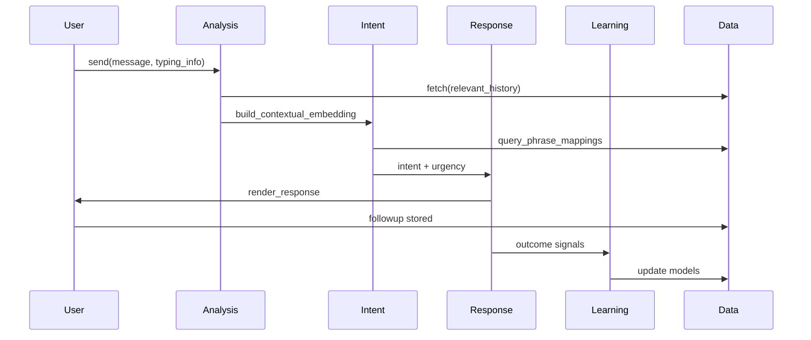

# Interaction Cycle Sequence Diagram

This sequence diagram shows the flow of a single user message through the system.

## Sequence Steps

| Step | From | To | Description |
|------|------|-----|-------------|
| 1 | User | Analysis | User sends a message with optional typing metadata |
| 2 | Analysis | Data | System fetches relevant user history for context |
| 3 | Analysis | Intent | Builds contextual embedding from message + history |
| 4 | Intent | Data | Queries phrase mappings for intent classification |
| 5 | Intent | Response | Passes classified intent with urgency level |
| 6 | Response | User | Renders appropriate response to user |
| 7 | User | Data | Follow-up interaction is stored |
| 8 | Response | Learning | Outcome signals are sent for model updates |
| 9 | Learning | Data | Models are updated in persistent storage |
