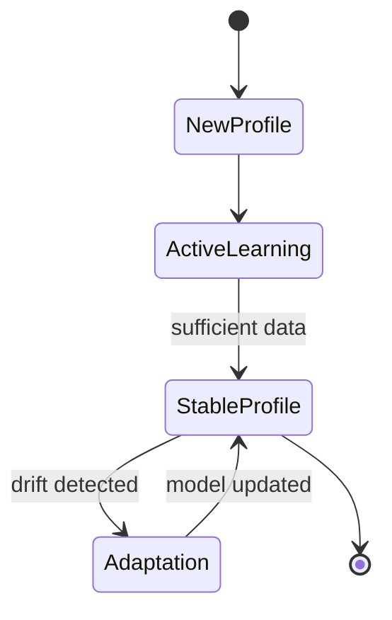

# User Profile State Evolution Diagram

This state diagram shows how a user's emotional profile evolves over time.

## State Descriptions

| State | Description | Trigger to Next State |
|-------|-------------|----------------------|
| **NewProfile** | Initial state when user first interacts | Automatic transition after first message |
| **ActiveLearning** | System is rapidly learning user patterns | After sufficient data (14 days OR 30 messages for mid-term) |
| **StableProfile** | Profile has stabilized, learning rate decreases | When behavioral drift is detected |
| **Adaptation** | System adapts to changed user behavior | After model is successfully updated |

## Activation Thresholds

### Short-Term State (⚡)
- **Activation**: Always active from message 1
- **Learning Rate (α)**: 0.15 (fast adaptation)

### Mid-Term State (📈)
- **Activation**: 14 days OR 30 messages
- **Window**: Rolling 15 messages

### Long-Term State (🏛️)
- **Activation**: 90 days OR 50 messages
- **Learning Rate (α)**: 0.02 (slow, stable baseline)
