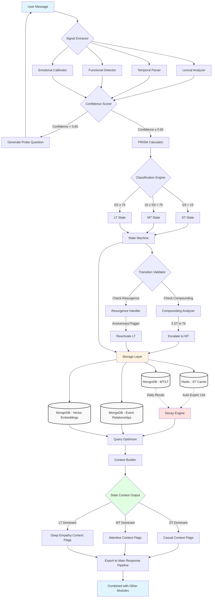

# State Management Flow Diagram

This comprehensive diagram shows the complete state management pipeline from user input to context output.



## Pipeline Stages

### 1. Signal Extraction
The system extracts multiple signals from the user message:

| Component | Purpose |
|-----------|---------|
| **Lexical Analyzer** | Keyword/phrase pattern matching for emotional content |
| **Temporal Parser** | Date/duration extraction using regex and dateparser |
| **Functional Detector** | Life domain impairment detection |
| **Emotional Calibrator** | User baseline normalization |

### 2. Confidence Scoring
Multi-signal agreement calculation determines processing path:
- **Confidence ≥ 0.65**: Proceed to PRISM calculation
- **Confidence < 0.65**: Generate probe question for clarification

### 3. PRISM Calculator
Calculates the Significance Score using the PRISM formula:

```
Significance Score = (P × R × I × S) / M

Where:
- P (Persistence): Expected duration [0.1-10.0]
- R (Resonance): Emotional intensity [1-10]
- I (Impact): Life domain breadth [1-5]
- S (Severity): Functional impairment [0.1-3.0]
- M (Malleability): Perceived control [0.5-2.0]
```

### 4. State Classification

| Score Range | State | Description |
|-------------|-------|-------------|
| SS < 15 | Short-Term (ST) | Transient moods, minor incidents |
| 15 ≤ SS < 75 | Mid-Term (MT) | Ongoing situations, recent events |
| SS ≥ 75 | Long-Term (LT) | Life-altering events, permanent shifts |

### 5. State Transitions

**Compounding**: 3 Short-Term incidents in 7 days → Escalate to Mid-Term
**Resurgence**: Anniversary or trigger detection → Reactivate Long-Term

### 6. Storage Layer

| Store | Purpose |
|-------|---------|
| **Redis** | Short-Term cache with 14-day auto-expire |
| **MongoDB (MT/LT)** | Persistent incident storage |
| **MongoDB (Events)** | Event relationship tracking |
| **MongoDB (Vectors)** | Vector embeddings for similarity |

### 7. Context Output
Based on dominant state, appropriate context flags are generated:
- **ST Dominant** → Casual Context Flags
- **MT Dominant** → Attentive Context Flags
- **LT Dominant** → Deep Empathy Context Flags
