# User Interaction Flow Diagram

This diagram shows the complete flow of a user message through the emotional state analysis pipeline.

```mermaid
graph TD
    A["💬 simple_chat.py<br/>User Input"] --> B[" orchestrator<br/>process_user_message"]
    
    B --> C[" _detect_emotions"]
    B --> D[" _extract_temporal"]
    
    C --> E[" Emotions<br/>Dict"]
    D --> F["⏱ Temporal<br/>Dict"]
    
    E --> G[" _calculate_and<br/>_apply_impact"]
    F --> G
    
    G --> H[" Impact<br/>Calculation"]
    
    H --> I[" state_updates<br/>Dict"]
    
    I --> J[" _update_user<br/>_profile"]
    
    J --> K["update_short_term"]
    J --> L[" update_mid_term"]
    J --> M[" update_long_term"]
    
    K --> N["Profile<br/>Updated"]
    L --> N
    M --> N
    
    B --> O["add_message_to<br/>_history"]
    
    O --> P[" History<br/>Updated"]
    
    N --> Q[" IncidentAnalysis<br/>Returned"]
    P --> Q
    
    Q --> R[" Generate<br/>Response"]
    
    R --> S[" Display to<br/>User"]
```



## Flow Description

### Input Stage
1. **User Input** arrives via `simple_chat.py` or `test_orchestrator.py`
2. The `orchestrator.process_user_message()` method is invoked

### Analysis Stage
The orchestrator performs two parallel analyses:

| Analysis | Method | Output |
|----------|--------|--------|
| **Emotion Detection** | `_detect_emotions()` | Dict of 27 emotions with probability scores |
| **Temporal Extraction** | `_extract_temporal()` | Dict with temporal phrases, days_ago, confidence |

### Impact Calculation
The `_calculate_and_apply_impact()` method combines:
- Emotion intensity (weighted)
- Recency weight (exponential decay)
- Temporal confidence
- Recurrence boost

Formula:
```
impact = (w_ei × intensity) + (w_rw × recency) + (w_tc × confidence) + (w_rb × recurrence)
```

### State Update
The profile is updated across three temporal dimensions:

| State | Method | Learning Rate |
|-------|--------|---------------|
| Short-Term | `update_short_term()` | α = 0.15 |
| Mid-Term | `update_mid_term()` | Rolling window (15 msgs) |
| Long-Term | `update_long_term()` | α = 0.02 |

### Output Stage
- `IncidentAnalysis` dataclass is returned containing:
  - Detected emotions
  - Temporal information
  - Impact score
  - State updates applied
- Message is added to history
- Response is generated and displayed
