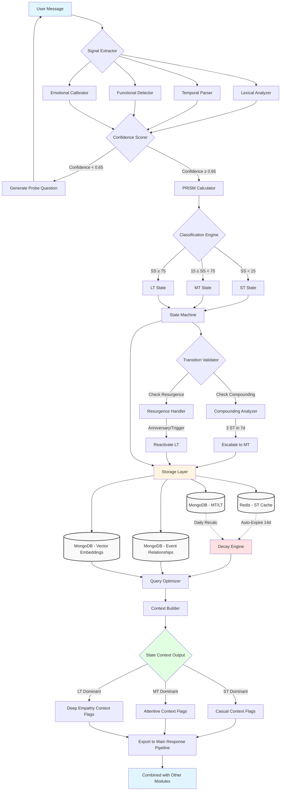

# State Management — Technical Documentation

> **Emotional State Analysis Module** — Temporal State Classification and Transitions

---

## Table of Contents

1. [Overview](#overview)
2. [Three Temporal States](#three-temporal-states)
3. [State Classification](#state-classification)
4. [PRISM Scoring Framework](#prism-scoring-framework)
5. [State Transitions](#state-transitions)
6. [Decay Mechanisms](#decay-mechanisms)
7. [Storage Architecture](#storage-architecture)
8. [Context Export](#context-export)

---

## Overview

The State Management system tracks user emotions across three temporal dimensions, allowing the AI companion to understand not just current mood, but emotional patterns and personality baselines.

### State Management Flow



---

## Three Temporal States

### Short-Term (ST) ⚡

**Time Horizon:** 0-14 days  
**Purpose:** Capture current mood and transient emotions

| Property | Value |
|----------|-------|
| Learning Rate | α = 0.15 |
| Activation | Always (from message 1) |
| Decay | Fast (exponential, λ = 0.3) |
| Update Method | EMA per message |

**Characteristics:**
- Most reactive to new emotions
- Reflects "how you're feeling right now"
- Quick to change, quick to fade
- Used for casual, empathetic responses

---

### Mid-Term (MT) 📈

**Time Horizon:** 2 weeks - 4 months  
**Purpose:** Track ongoing situations and emotional patterns

| Property | Value |
|----------|-------|
| Window Size | 15 messages |
| Activation | 14 days OR 30 messages |
| Decay | S-curve (half-life 60 days) |
| Update Method | Rolling window average |

**Characteristics:**
- Captures "what's been going on lately"
- Smooths out day-to-day fluctuations
- Shows emotional trends
- Used for supportive, validating responses

---

### Long-Term (LT) 🏛️

**Time Horizon:** 4+ months (permanent)  
**Purpose:** Represent personality baseline and life-altering events

| Property | Value |
|----------|-------|
| Learning Rate | α = 0.02 |
| Activation | 90 days OR 50 messages |
| Decay | Asymptotic with resurgence |
| Update Method | Slow EMA |

**Characteristics:**
- Most stable state
- Reflects "who you are emotionally"
- Changes slowly over months
- Used for deep empathy responses

---

## State Classification

### Classification Based on Significance Score

| Score Range | Classification | Description |
|-------------|----------------|-------------|
| SS < 15 | Short-Term (ST) | Transient mood, minor incident |
| 15 ≤ SS < 75 | Mid-Term (MT) | Ongoing situation, recent event |
| SS ≥ 75 | Long-Term (LT) | Life-altering, permanent shift |

### Multi-Signal Extraction

The system extracts multiple signals to classify incidents:

1. **Lexical Analysis**
   - Emotion word detection
   - Sentiment scoring
   - Keyword pattern matching

2. **Temporal Parsing**
   - Time reference extraction
   - Duration calculation
   - Age categorization

3. **Functional Detection**
   - Life domain impact (work, relationships, health, etc.)
   - Impairment level assessment

4. **Emotional Calibration**
   - User baseline normalization
   - Historical comparison

---

## PRISM Scoring Framework

### Formula

```
Significance Score (SS) = (P × R × I × S) / M
```

### Components

| Component | Range | Description |
|-----------|-------|-------------|
| **P** (Persistence) | 0.1-10.0 | Expected duration of emotional impact |
| **R** (Resonance) | 1-10 | Emotional intensity/strength |
| **I** (Impact) | 1-5 | Number of life domains affected |
| **S** (Severity) | 0.1-3.0 | Functional impairment level |
| **M** (Malleability) | 0.5-2.0 | Perceived control/adaptability |

### Example Calculations

**Example 1: Minor Work Stress**
```
P = 0.5 (few days)
R = 4 (moderate intensity)
I = 1 (only work)
S = 0.5 (mild impairment)
M = 1.5 (good coping)

SS = (0.5 × 4 × 1 × 0.5) / 1.5 = 0.67 → ST
```

**Example 2: Job Loss**
```
P = 5.0 (months)
R = 8 (high intensity)
I = 3 (work, finances, identity)
S = 2.0 (significant impairment)
M = 1.0 (moderate coping)

SS = (5.0 × 8 × 3 × 2.0) / 1.0 = 240 → LT
```

**Example 3: Relationship Issues**
```
P = 2.0 (weeks)
R = 6 (strong)
I = 2 (relationships, mood)
S = 1.5 (moderate impairment)
M = 1.2 (some coping)

SS = (2.0 × 6 × 2 × 1.5) / 1.2 = 30 → MT
```

---

## State Transitions

### Escalation: ST → MT (Compounding)

When multiple short-term incidents cluster together, they can escalate to mid-term:

**Rule:** 3 ST incidents in 7 days → Escalate to MT

```python
def check_compounding(recent_st_incidents):
    seven_days_ago = datetime.now() - timedelta(days=7)
    recent = [i for i in recent_st_incidents if i.timestamp > seven_days_ago]
    
    if len(recent) >= 3:
        return escalate_to_mt(recent)
```

### Escalation: MT → LT (Persistence)

When mid-term states persist beyond expected duration:

**Rule:** MT persists > 120 days with SS > 40 → Escalate to LT

### Resurgence (LT Reactivation)

Long-term states can resurface due to triggers:

**Triggers:**
- Anniversary dates
- Similar events
- Contextual reminders

```python
def check_resurgence(message, lt_incidents):
    for incident in lt_incidents:
        if is_anniversary(incident.date):
            return reactivate_lt(incident)
        if is_similar_context(message, incident):
            return reactivate_lt(incident)
```

---

## Decay Mechanisms

### Short-Term Decay

Fast exponential decay:

```python
Relevance(t) = Initial_SS × e^(-0.3t)
# 70% reduction every 2 days
```

| Days | Relevance |
|------|-----------|
| 0 | 100% |
| 2 | 55% |
| 5 | 22% |
| 7 | 12% |
| 14 | 1.5% (auto-expire) |

### Mid-Term Decay

S-curve decay with configurable half-life:

```python
Relevance(t) = Initial_SS / (1 + e^(k(t - t_half)))
# S-curve decay over 60-120 days
```

| Days | Relevance |
|------|-----------|
| 0 | 100% |
| 30 | 80% |
| 60 | 50% (half-life) |
| 90 | 20% |
| 120 | 5% |

### Long-Term Decay

Asymptotic decay with trauma resurgence:

```python
Relevance(t) = Baseline_SS + (Initial_SS - Baseline_SS) × e^(-μt) + ξ(t)
# Where ξ(t) is the resurgence function
```

- Never fully decays to zero
- Maintains baseline relevance
- Can spike on anniversaries or triggers

---

## Storage Architecture

### Redis (Short-Term)

**Purpose:** Fast, volatile cache for ST incidents

```
Key: user:{user_id}:st_incidents
Type: Sorted Set
Score: Timestamp
TTL: 14 days (auto-expire)
```

**Example:**
```redis
ZADD user:123:st_incidents 1708300800 "{\"emotion\":\"stress\",\"score\":0.72}"
EXPIRE user:123:st_incidents 1209600  # 14 days
```

### MongoDB (Mid/Long-Term)

**Collections:**

| Collection | Purpose |
|------------|---------|
| `incidents` | MT/LT incident storage |
| `event_graph` | Incident relationships |
| `embeddings` | Vector search |
| `user_baselines` | Emotional calibration |

**Incident Schema:**
```javascript
{
  _id: ObjectId,
  user_id: String,
  state_layer: "MT" | "LT",
  emotion: String,
  significance_score: Number,
  prism_components: {
    persistence: Number,
    resonance: Number,
    impact: Number,
    severity: Number,
    malleability: Number
  },
  created_at: ISODate,
  last_decay_calc: ISODate,
  current_relevance: Number
}
```

---

## Context Export

### State Context Output

The system exports context based on dominant state:

```python
temporal_context = {
    "dominant_state": "MT",  # Most relevant state
    "state_distribution": {
        "ST": 0.15,
        "MT": 0.60,
        "LT": 0.25
    },
    "empathy_level": "moderate",  # casual | moderate | deep
    "tone_recommendation": "attentive_validating",
    "active_incidents": [...]
}
```

### Context Flags by State

| Dominant State | Context Flags | Response Style |
|----------------|---------------|----------------|
| ST | `casual_empathy` | Light, conversational |
| MT | `attentive_validating` | Supportive, acknowledging |
| LT | `deep_empathy` | Profound understanding |

### Integration Example

```python
# In response generation
if context["dominant_state"] == "LT":
    response_tone = "I can see this has deeply affected you..."
elif context["dominant_state"] == "MT":
    response_tone = "It sounds like you've been dealing with..."
else:
    response_tone = "That sounds frustrating..."
```

---

## Configuration

### Key Parameters

```python
# State thresholds
ST_THRESHOLD = 15
MT_THRESHOLD = 75

# Decay constants
ST_DECAY_LAMBDA = 0.3
MT_HALF_LIFE_DAYS = 60

# Life domains
LIFE_DOMAINS = ['work', 'relationships', 'health', 'identity', 'safety']

# Compounding rules
COMPOUNDING_WINDOW_DAYS = 7
COMPOUNDING_MIN_INCIDENTS = 3
```

---

## Summary

The State Management system provides:

- ✅ **Three-tier temporal tracking** (ST, MT, LT)
- ✅ **PRISM-based classification** for consistent scoring
- ✅ **Automatic transitions** (escalation and resurgence)
- ✅ **Appropriate decay** for each state type
- ✅ **Context-aware output** for response generation

This enables the AI companion to understand emotional context across multiple time horizons and respond with appropriate empathy levels.

---

## Related Documentation

- [Data Flow](./data-flow.md) — How data moves through states
- [EMA Approach](./ema-approach.md) — Learning rate details
- [User Profile Module](./modules/user-profile.md) — State storage
