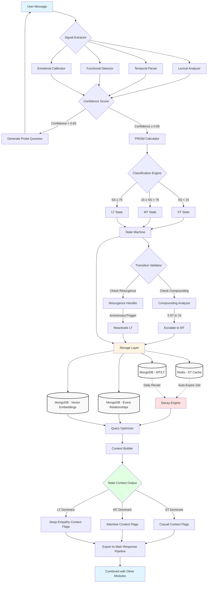

# Temporal State Engine

A sophisticated AI module for tracking and adapting to users' emotional states across three temporal dimensions: Short-Term (ST), Mid-Term (MT), and Long-Term (LT).

## 📁 Module Structure
```
temporal_state_engine/
│
├── core/
│   ├── __init__.py
│   ├── models.py                    # Pydantic models for Incident, StateTransition
│   ├── enums.py                     # StateLayer, LifeDomain, ImpairmentLevel
│   └── config.py                    # Decay constants, thresholds, domain weights
│
├── extraction/
│   ├── __init__.py
│   ├── signal_extractor.py          # Main extraction orchestrator
│   ├── lexical_analyzer.py          # Keyword/phrase pattern matching
│   ├── temporal_parser.py           # Date/duration extraction (using dateparser)
│   ├── functional_detector.py       # Life domain impairment detection
│   ├── emotional_calibrator.py      # User baseline normalization
│   └── confidence_scorer.py         # Multi-signal agreement calculation
│
├── scoring/
│   ├── __init__.py
│   ├── prism_calculator.py          # PRISM score computation
│   ├── classification_engine.py     # ST/MT/LT threshold assignment
│   ├── compounding_analyzer.py      # Cluster detection (3 ST → MT)
│   └── similarity_matcher.py        # Vector-based incident comparison
│
├── state_management/
│   ├── __init__.py
│   ├── state_machine.py             # Core FSM for state transitions
│   ├── decay_engine.py              # Time-based relevance recalculation
│   ├── resurgence_handler.py        # Trauma trigger detection & reactivation
│   ├── transition_validator.py      # Rule-based escalation/demotion checks
│   └── snapshot_manager.py          # Historical state capture for audit
│
├── storage/
│   ├── __init__.py
│   ├── redis_client.py              # ST layer (volatile cache with TTL)
│   ├── mongodb_client.py            # Main MongoDB connection manager
│   ├── collections/
│   │   ├── __init__.py
│   │   ├── incidents.py             # MT/LT incidents collection handler
│   │   ├── event_graph.py           # Event relationships collection
│   │   ├── embeddings.py            # Vector embeddings collection
│   │   └── user_baselines.py       # User emotional calibration data
│   └── indexes/
│       ├── incident_indexes.py      # user_id, state_layer, created_at indexes
│       └── vector_indexes.py        # MongoDB vector search indexes
│
├── orchestration/
│   ├── __init__.py
│   ├── pipeline.py                  # End-to-end processing pipeline
│   ├── background_jobs.py           # Scheduled decay recalculations
│   ├── event_bus.py                 # Pub/sub for state change notifications
│   └── query_optimizer.py           # Cross-layer retrieval strategies
│
├── context_export/
│   ├── __init__.py
│   ├── context_builder.py           # Assembles relevant incidents for export
│   ├── state_summarizer.py          # Creates state distribution summary
│   └── empathy_flags.py             # Generates context flags for main pipeline
│
├── utils/
│   ├── __init__.py
│   ├── logger.py                    # Structured logging with PII scrubbing
│   ├── metrics.py                   # Classification accuracy tracking
│   └── validators.py                # Input sanitization & schema validation
│
├── tests/
│   ├── unit/
│   │   ├── test_prism_calculator.py
│   │   ├── test_decay_engine.py
│   │   ├── test_state_machine.py
│   │   └── test_mongodb_collections.py
│   ├── integration/
│   │   ├── test_end_to_end_pipeline.py
│   │   └── test_storage_layer.py
│   └── fixtures/
│       ├── sample_conversations.json
│       └── mock_user_histories.json
│
├── docs/
│   ├── module_overview.md           # High-level module purpose
│   ├── integration_guide.md         # How to integrate with main project
│   ├── api_reference.md             # Function signatures & examples
│   └── clinical_safety.md           # Suicide risk protocols
│
├── scripts/
│   ├── seed_database.py             # Load test data
│   ├── recalculate_all_states.py   # Batch reprocessing script
│   └── export_user_timeline.py     # Debugging/audit tool
│
├── requirements.txt
├── pyproject.toml
├── docker-compose.yml               # Redis + MongoDB services
└── README.md
```

## 🎯 Overview

The Temporal State Engine analyzes user conversations to detect and track life incidents across three temporal states:

- **Short-Term (ST):** Transient moods and minor daily incidents (0-14 days)
- **Mid-Term (MT):** Ongoing situations from recent significant events (2 weeks - 4 months)
- **Long-Term (LT):** Deep shifts from life-altering events (permanent baseline)

## 🧠 Core Features

### PRISM Scoring Framework
```
Significance Score = (P × R × I × S) / M

Where:
- P (Persistence): Expected duration [0.1-10.0]
- R (Resonance): Emotional intensity [1-10]
- I (Impact): Life domain breadth [1-5]
- S (Severity): Functional impairment [0.1-3.0]
- M (Malleability): Perceived control [0.5-2.0]
```

### State Classification
- **ST**: Score < 15
- **MT**: Score 15-75
- **LT**: Score ≥ 75

### Multi-Signal Extraction
1. **Lexical Analysis**: Emotion word detection and sentiment scoring
2. **Temporal Parsing**: Time reference extraction and duration calculation
3. **Functional Detection**: Life domain impact assessment
4. **Emotional Calibration**: User baseline normalization


```

### Basic Usage
```python
from temporal_state_engine.orchestration.pipeline import process_user_message

# Process a user message
result = await process_user_message(
    message="I've been really stressed about my job for the last month",
    user_id="user_123"
)

# Access temporal context
print(result['dominant_state'])  # 'MT'
print(result['empathy_level'])   # 'moderate'
```

## 🗄️ Storage Architecture

### Redis (Short-Term)
- Auto-expiring cache (14-day TTL)
- Fast incident retrieval
- Sorted sets for chronological ordering

### MongoDB (Mid/Long-Term)
- **Collections:**
  - `incidents`: MT/LT incident storage
  - `event_graph`: Incident relationships
  - `embeddings`: Vector search for similarity
  - `user_baselines`: Calibration data

## State Transition & Decay

### Short-Term Decay
```python
Relevance(t) = Initial_SS × e^(-0.3t)
# 70% reduction every 2 days
```

### Mid-Term Decay
```python
Relevance(t) = Initial_SS / (1 + e^(k(t - t_half)))
# S-curve decay over 60-120 days
```

### Long-Term Decay
```python
Relevance(t) = Baseline_SS + (Initial_SS - Baseline_SS) × e^(-μt) + ξ(t)
# Asymptotic with trauma resurgence
```

## 🔗 Integration

This module exports context data to the main application pipeline:
```python
temporal_context = {
    "dominant_state": "MT",
    "state_distribution": {"ST": 0.15, "MT": 0.60, "LT": 0.25},
    "empathy_level": "moderate",
    "tone_recommendation": "attentive_validating",
    "active_incidents": [...]
}
```


## 🛠️ Configuration

Key configuration in `core/config.py`:
```python
# State thresholds
ST_THRESHOLD = 15
MT_THRESHOLD = 75

# Decay constants
ST_DECAY_LAMBDA = 0.3
MT_HALF_LIFE_DAYS = 60

# Life domains
LIFE_DOMAINS = ['work', 'relationships', 'health', 'identity', 'safety']
```